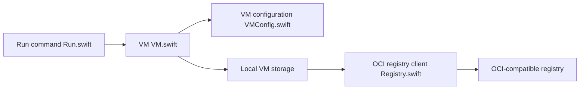

# openai/tart

> Outil de virtualisation pour créer et exécuter des VM macOS et Linux sur Apple Silicon, destiné à la CI.

## Le problème
Les CI ont besoin de VM macOS jetables, reproductibles et à performances proches du natif.

## Ce que ça fait vraiment
S'appuie sur `Virtualization.Framework` d'Apple pour lancer des VM macOS ou Linux. Pousse et tire des images vers n'importe quel registre OCI, s'intègre avec un plugin Packer et expose réseau, VNC et gestion du stockage local.

## Comment c'est branché


## Essayer
```bash
brew install openai/tools/tart
tart clone ghcr.io/cirruslabs/macos-tahoe-base:latest tahoe-base
tart run tahoe-base
```

## Coût et pièges
Apple Silicon et macOS 13+ obligatoires ; image de base de 25 Go. La licence est présente mais non identifiée par GitHub : à lire avant usage.

## Ce que ce n'est pas
Pas un hyperviseur x86 ni un outil Linux seul : il requiert du matériel Apple.

## Alternatives
Aucune alternative nommée dans le README.

## Pour toi
À ignorer sauf si tu gères des runners CI sur Mac ; sans intérêt pour un workflow data/IA courant.

