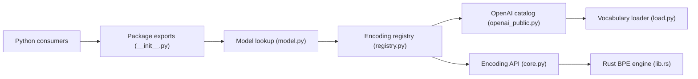

# openai/tiktoken

> Tokeniseur BPE en Rust avec API Python, utilisé par les modèles OpenAI.

## Le problème
Compter ou découper des tokens exactement comme le modèle cible est nécessaire pour budgéter coûts et contexte, et les tokeniseurs en pur Python sont lents.

## Ce que ça fait vraiment
`get_encoding("o200k_base")` ou `encoding_for_model("gpt-4o")` renvoie un `Encoding` qui encode et décode de façon réversible.
Le cœur BPE est en Rust, exposé par des bindings ; le README annonce 3 à 6 fois plus rapide qu'un tokeniseur comparable (mesure de l'auteur).
Registre extensible par plugins `tiktoken_ext` ; vocabulaires chargés et mis en cache par `load.py`.
Module `_educational` pour entraîner et visualiser un BPE simple.

## Comment c'est branché


## Essayer
```bash
pip install tiktoken
```

## Coût et pièges
Gratuit. Le premier appel télécharge les vocabulaires : prévoir le cache en environnement hors ligne.

## Ce que ce n'est pas
Pas un tokeniseur universel : il couvre les encodages OpenAI, pas ceux de Llama ou Qwen. Pas un outil d'entraînement de tokeniseur en production.

## Alternatives
Aucune alternative nommée ; le benchmark cite `GPT2TokenizerFast` de tokenizers/transformers comme point de comparaison.

## Pour toi
À adopter : indispensable pour estimer coûts et longueur de contexte avant d'appeler une API, et pour découper des documents en chunks de RAG.
