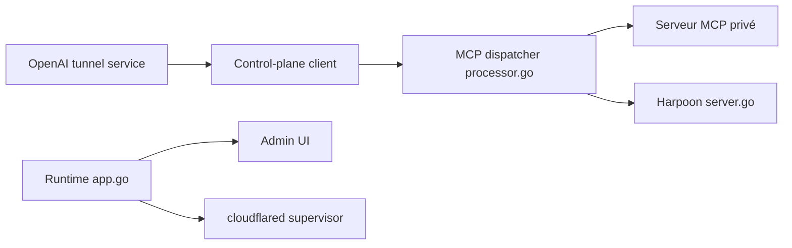

# openai/tunnel-client

> Agent Go qui relie un serveur MCP privé ou local à ChatGPT, Codex et l'API Responses.

## Le problème
Exposer un serveur MCP interne à un produit OpenAI demanderait une règle de pare-feu entrante ou un endpoint public.

## Ce que ça fait vraiment
Interroge en long-polling le plan de contrôle des tunnels OpenAI en HTTPS, relaie les requêtes JSON-RPC vers ton serveur MCP (HTTP, stdio ou mémoire) et renvoie les réponses. Fournit UI d'admin, `/healthz`, `/readyz`, `/metrics`, découverte OAuth, un serveur « Harpoon » pour appels HTTP en liste blanche et un cloudflared embarqué.

## Comment c'est branché


## Essayer
```bash
brew install openai/tools/tunnel-client
tunnel-client help quickstart
tunnel-client doctor --profile local-stdio --explain
tunnel-client run --profile local-stdio
```

## Coût et pièges
Exige un tunnel et une clé d'API runtime sur la plateforme OpenAI, avec permissions Tunnels. Une seule instance par tunnel en mode stdio.

## Ce que ce n'est pas
Pas un tunnel générique : inutilisable sans le service hébergé par OpenAI. Les ZIP téléchargés ne sont pas notarisés sur macOS.

## Alternatives
Aucune alternative citée dans le README (cloudflared est embarqué).

## Pour toi
À surveiller : utile seulement si tu branches un MCP privé sur ChatGPT ou Codex ; sinon le verrouillage OpenAI n'apporte rien.

