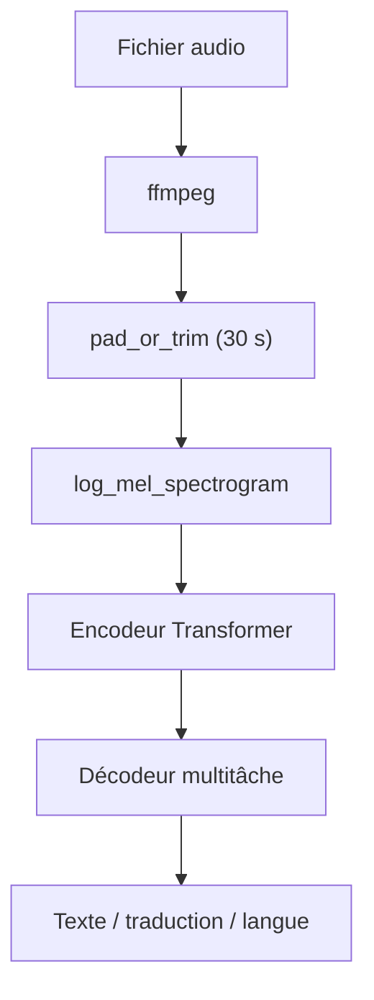

# openai/whisper

> Modèle de reconnaissance vocale multilingue, avec transcription, traduction et détection de langue.

## Le problème
Transcrire de l'audio suppose habituellement d'enchaîner détection d'activité vocale, segmentation et décodage.
Les API de transcription facturent à la minute et envoient l'audio chez un tiers.

## Ce que ça fait vraiment
Un seul modèle Transformer encodeur-décodeur couvre transcription multilingue, traduction et identification de langue.
Six tailles, de `tiny` (39 M, ~1 Go de VRAM) à `large` (1550 M, ~10 Go), plus `turbo` (809 M, ~8× plus rapide).
`transcribe()` lit le fichier entier et le traite par fenêtre glissante de 30 secondes.
API bas niveau disponible : `load_audio`, `log_mel_spectrogram`, `detect_language`, `decode`.

## Comment c'est branché


## Essayer
```bash
pip install -U openai-whisper
whisper audio.flac audio.mp3 audio.wav --model turbo
whisper japanese.wav --model medium --language Japanese --task translate
whisper --help
```

## Coût et pièges
Gratuit, tout tourne en local. `ffmpeg` est obligatoire ; `rust` peut l'être si tiktoken n'a pas de wheel.
Sans GPU, `large` est très lent ; la VRAM nécessaire va de 1 à 10 Go selon la taille.

## Ce que ce n'est pas
Pas un système de diarisation : il ne sépare pas les locuteurs.
`turbo` ne sait pas traduire — il rend la langue d'origine même avec `--task translate`.
La qualité varie fortement selon la langue ; le README renvoie aux WER par langue du papier.

## Alternatives
- `ollama/ollama` : sans rapport direct, mais même logique d'exécution locale de modèles.

## Pour toi
La référence pour transcrire en local sans envoyer l'audio ailleurs. À adopter.
