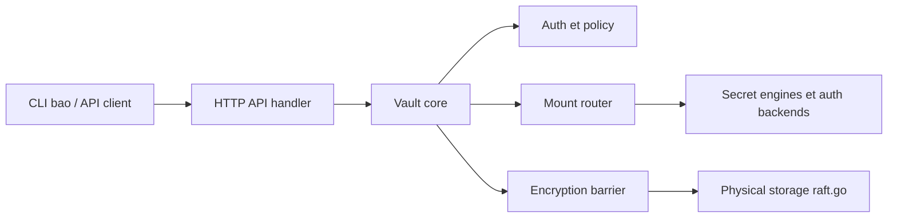

# openbao/openbao

> Serveur Go de gestion de secrets, certificats et clés, fork communautaire pour équipes infra et sécurité.

## Le problème
Les identifiants de bases, clés d'API et certificats se retrouvent dispersés, sans rotation ni audit centralisé de qui accède à quoi.

## Ce que ça fait vraiment
Stockage chiffré de secrets clé/valeur (disque, PostgreSQL, Raft intégré, PebbleDB), génération de secrets dynamiques (AWS, bases SQL) avec bail et révocation automatique, chiffrement à la demande (moteur transit), audit des accès. Les backends d'authentification (AppRole, JWT/OIDC, Kubernetes) et les moteurs sont montés dynamiquement, les plugins tournent en gRPC hors processus.

## Comment c'est branché


## Essayer
```bash
mkdir -p bin
go build -o bin/bao .
go run . server -dev
go test ./some/package
```

## Coût et pièges
Compilation Go depuis les sources (le README ne documente pas d'installation binaire). Le mode `-dev` est un mode de développement. L'import de `github.com/openbao/openbao` comme dépendance n'est pas supporté.

## Ce que ce n'est pas
Pas un simple coffre de mots de passe : c'est un serveur à exploiter (scellement, haute dispo, audit). Seules les bibliothèques `api/v2` et `sdk/v2` sont publiées pour import.

## Alternatives
Aucune alternative nommée dans le README (il ne cite que la licence OSI comme raison d'être).

## Pour toi
À surveiller : utile dès que tes pipelines ML/MLOps manipulent des clés d'API et identifiants de bases qu'il faut faire tourner, mais c'est un service d'infra à exploiter, pas un outil à essayer un après-midi.

