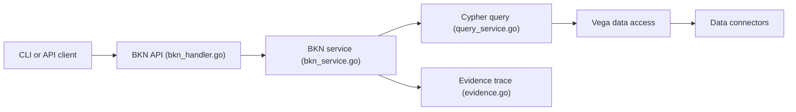

# openbkn-ai/bkn-foundry

> Socle backend d'un réseau de connaissances métier par ontologie, pour donner du contexte fiable aux agents.

## Le problème
Les agents connectés à des données propriétaires subissent explosion de contexte, hallucinations et actions non contrôlées.

## Ce que ça fait vraiment
Backend sans interface web : moteur BKN (objets, relations, risques, actions, langage BKN en Markdown), chargeur de contexte (rappel puis classement), virtualisation de données VEGA, fabrique d'exécution d'outils MCP, contrôle d'accès et traçage des preuves. Le code montre les API BKN et métriques, la requête Cypher et l'accès via Vega ; le reste est décrit par le README.

## Comment c'est branché


## Essayer
```bash
git clone https://github.com/openbkn-ai/bkn-foundry.git
cd bkn-foundry/deploy
sudo bash ./preflight.sh
./deploy.sh openbkn install
sudo bash ./onboard.sh
npm install -g @openbkn/bkn-sdk
```

## Coût et pièges
Cible Linux avec Kubernetes, kubectl, helm et containerd ; le script `onboard.sh` enregistre un LLM et un modèle d'embedding, donc clés à votre charge. Le mot de passe par défaut de l'utilisateur `test` est 111111 ; 191 issues ouvertes.

## Ce que ce n'est pas
Pas une application clé en main : pas de console web dans ce dépôt (BKN Studio est ailleurs). Les benchmarks (99,31 % de précision, comparaison à Dify et RAGFlow) sont publiés par les auteurs et non reproduits ici.

## Alternatives
- Dify, RAGFlow, BiSheng : plateformes comparées dans le README, plus simples à déployer.

## Pour toi
À surveiller pour la gouvernance des agents (traçage, contrôle d'accès), mais déploiement lourd, licence à vérifier et résultats non indépendants.
