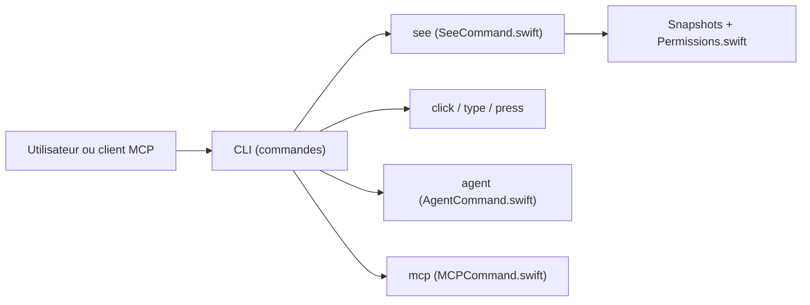

# openclaw/Peekaboo

> CLI et app macOS pour capturer l'écran, inspecter l'interface et automatiser les clics, utilisables par agents MCP.

## Le problème
Les agents et scripts ne voient pas l'écran ni ne pilotent les applications natives macOS de façon structurée.

## Ce que ça fait vraiment
`peekaboo see` capture l'écran ou une app et renvoie une carte de l'interface avec identifiants d'éléments ; `click`, `type`, `press`, `scroll`, `menu`, `window` agissent dessus, en arrière-plan si la fenêtre est résolue. Un agent exécute des tâches en langage naturel (`peekaboo agent`) et le même jeu d'outils s'expose en serveur MCP (Codex, Claude Code, Cursor). Une app de barre de menus gère permissions et sessions.

## Comment c'est branché


## Essayer
```bash
brew install openclaw/tap/peekaboo
peekaboo permissions status
peekaboo see --app Finder --json
npx -y @steipete/peekaboo --version
```

## Coût et pièges
macOS 15+ ; permissions Enregistrement d'écran et Accessibilité requises. Le mode agent exige un fournisseur de modèle configuré (clés dans `~/.peekaboo`). Node 22+ pour npm.

## Ce que ce n'est pas
Pas multiplateforme : macOS uniquement. L'agent peut agir sur ton poste ; les accords de premier plan sont explicites mais à surveiller.

## Alternatives
Non documenté dans le README : aucune alternative nommée.

## Pour toi
À surveiller si tu travailles sur Mac avec des agents de code : un outil d'observation et d'action sur l'écran étend ce qu'un client MCP peut faire ; inutile sinon sous Linux.

