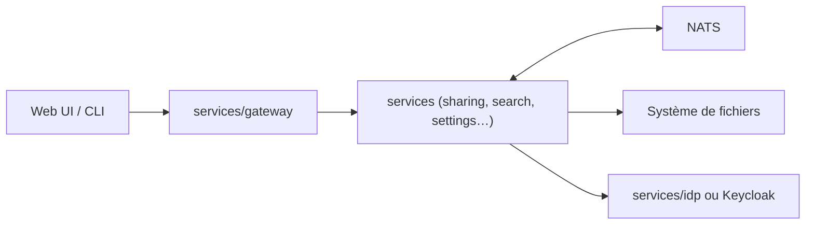

# opencloud-eu/opencloud

> Serveur backend en Go d'une plateforme de partage de fichiers auto-hébergée, pour équipes et organisations.

## Le problème
Héberger son propre stockage collaboratif sans dépendre d'un cloud américain.

## Ce que ça fait vraiment
Monorepo de nombreux services Go (gateway, partage, recherche, paramètres, collaboration, notifications, journal d'activité) supervisés par le binaire `opencloud`. Authentification OpenID Connect via Keycloak ou l'IdP intégré LibreGraph Connect. Aucune base de données : tout est stocké dans le système de fichiers (`$HOME/.opencloud`). Bus d'événements NATS.

## Comment c'est branché


## Essayer
```bash
make generate
make -C opencloud build
opencloud/bin/opencloud init && opencloud/bin/opencloud server
```

## Coût et pièges
Gratuit, Apache-2.0. Compilation depuis les sources ; la plupart des utilisateurs passeront par la doc d'installation. Beaucoup d'issues ouvertes (445), projet créé en janvier 2025.

## Ce que ce n'est pas
Ce dépôt n'est que le backend ; le client web et l'installation guidée sont ailleurs.

## Alternatives
Aucune nommée dans le README.

## Pour toi
À surveiller : intéressant pour héberger des jeux de données en interne, mais c'est du stockage, pas de l'IA.

