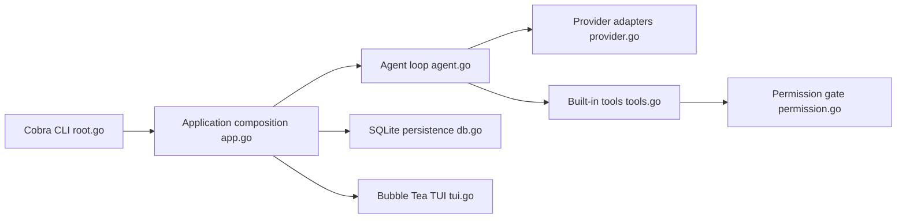

# opencode-ai/opencode

> Assistant de code IA en terminal (Go, TUI), archivé au profit de Crush.

## Le problème
Coder avec un LLM hors IDE, en terminal, avec outils fichiers et shell et plusieurs fournisseurs.

## Ce que ça fait vraiment
TUI Bubble Tea, sessions stockées en SQLite, compaction automatique à 95 % du contexte.
Outils : glob, grep, view, write, edit, patch, bash, fetch, sourcegraph, sous-agent ; permissions à valider.
Fournisseurs : OpenAI, Anthropic, Gemini, Bedrock, Groq, Azure, OpenRouter, Copilot, endpoint local.
MCP (stdio, SSE), diagnostics LSP, commandes personnalisées en Markdown.

## Comment c'est branché


## Essayer
```bash
brew install opencode-ai/tap/opencode
go install github.com/opencode-ai/opencode@latest
opencode -p "Explain the use of context in Go" -f json
```

## Coût et pièges
Clés d'API des fournisseurs à ta charge. En mode non interactif, toutes les permissions sont auto-approuvées.

## Ce que ce n'est pas
Archivé : plus maintenu. Ne pas confondre avec les projets actifs portant un nom proche.

## Alternatives
- charmbracelet/crush : suite officielle par l'auteur d'origine et l'équipe Charm.

## Pour toi
À ignorer : archivé, prends directement Crush si l'approche t'intéresse.
