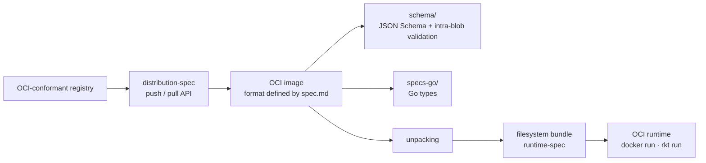

# opencontainers/image-spec

> **The container image format specification, plus the Go types and JSON Schema that validate it.**

## The problem

Without a shared image format, every container engine imposes its own: an image built for one
cannot be read by another, and any tool that wants to inspect, sign or rewrite an image has to
reverse-document a proprietary format. The README states the opposite goal — an open
specification shareable between different tools and stable "for years or decades", on the model
of the deb and rpm formats.

## What it actually does

The repository is first of all a text: the OCI image format specification, which the README
points to as `spec.md`. That document is the reference, not an implementation.

The README then announces three code deliverables in the same repository: **Go types**
(directory `specs-go`), **intra-blob validation tooling** and a **JSON Schema** (directory
`schema`). It notes that the Go types and validation target the current Go release, and that
earlier Go releases are not supported.

The README also places the format in the OCI chain: an image carries enough information to
launch the application on the target platform (command, arguments, environment variables),
which is what allows the expected container-engine experience — running an image with no extra
arguments, `docker run example.com/org/app:v1.0.0`.

The rest of the README (more than half of it) covers how the working group operates: mailing
list, meetings, one-sentence-per-line Markdown style, the Developer Certificate of Origin and
commit message conventions. The roadmap is delegated to GitHub milestones.

## How it is wired



No code-derived diagram exists for this repository: the graph above is reconstructed from the
README alone, which names only two directories (`specs-go`, `schema`) and one file (`spec.md`).
The point is the boundary: this repository defines the image **at rest**; unpacking into a
"filesystem bundle" and execution belong to `runtime-spec`, and transport to a registry belongs
to `distribution-spec`.

## Trying it

```bash
# The README documents no installation or usage command.
# You read the specification (spec.md); the Go types are referenced through pkg.go.dev.
```

The only command present in the README concerns contributing, not usage:

```bash
git commit -s
```

It adds the `Signed-off-by:` line required by the Developer Certificate of Origin, mandatory on
every submitted commit.

## Cost and pitfalls

- **Nothing to install, nothing to pay**: Apache 2.0 licence, announced in the README (the
  repository's `LICENSE` file), no account, no third-party service, no key.
- **The README does not document how to use the code.** No `go get`, no example call of the Go
  types, no invocation of the validation tool. You have to open `specs-go` and `schema` to find
  out what to do with them — that is the real entry cost, and the reason for the "insufficient
  material" alert: the substance lives elsewhere (`spec.md`, the milestones, the mailing list).
- **Implicit Go window**: the README says the Go types should be compatible with the current Go
  release and that earlier releases are not supported. No numbered bound is given, so there is
  no guarantee on a pinned toolchain.
- **Formalised contribution**: DCO sign-off is mandatory, real names are required ("sorry, no
  pseudonyms"), and any non-trivial change to the specification must be discussed on the mailing
  list first. A pull request is explicitly not the place for design discussion.
- **Versioning**: the release process is delegated to `RELEASES.md` and not summarised in the
  README. Pinning a specification version means reading that file.

## What it is not

- **It is not a container engine or a runtime.** You do not build or run images with this
  repository; it describes the format. The README explicitly hands execution to `runtime-spec`
  and transport to `distribution-spec`.
- **It is not an application library.** The Go types are data structures of the format, not an
  image-manipulation API: nothing in the README promises building, merging or pushing images.
- **It is not a learning guide to containers.** The README is a project-governance text; the
  technical content sits in `spec.md`, written as a standard.
- **It is not a decree replacing existing formats**: the README's FAQ says AppC and Docker image
  formats can keep serving as proving grounds for new technologies.

## Alternatives

No comparable alternative in the catalogue: the suggested neighbours
(`podman-container-tools/podman`, `containerd/containerd`, `google/gvisor`, `anchore/grype`) are
all **implementations** or consumers of the format — engine, runtime, sandbox, vulnerability
scanner — not competing specifications. The README names no rival format to adopt either, only
the sibling OCI projects (`opencontainers/runtime-spec` for execution,
`opencontainers/distribution-spec` for distribution) which complement this one rather than
replace it.

## For you

Worth adopting as a reference, not as a project dependency. As soon as you handle images —
building training or inference images, layer caching, signing, inspecting manifests in an MLOps
chain — this is where the authoritative definition of manifests, indexes, descriptors and layers
lives, and the Go types save you from redeclaring those structures by hand. Do not open it if
your question is "how do I build my image": this repository answers "here is what an image is",
which is a different question.
