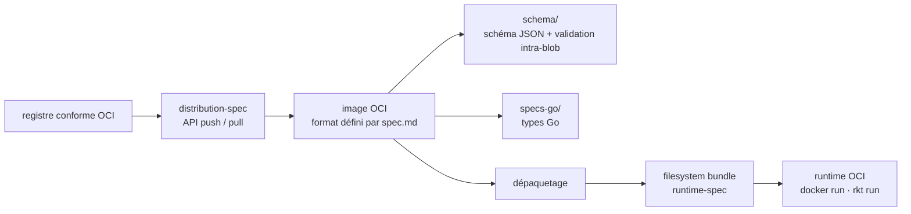

# opencontainers/image-spec

> **La spécification du format d'image de conteneur, plus les types Go et le schéma JSON qui la valident.**

## Le problème

Sans format d'image commun, chaque moteur de conteneurs impose le sien : une image construite
pour l'un ne se lit pas chez l'autre, et tout outil qui veut inspecter, signer ou réécrire une
image doit rétro-documenter un format propriétaire. Le README pose l'objectif inverse — une
spécification ouverte partageable entre outils différents et stable « pendant des années ou des
décennies », sur le modèle des formats deb et rpm.

## Ce que ça fait vraiment

Le dépôt est d'abord un texte : la spécification du format d'image OCI, que le README renvoie
vers `spec.md`. C'est le document de référence, pas une implémentation.

Le README annonce ensuite trois livrables de code, dans le même dépôt : des **types Go**
(répertoire `specs-go`), un **outillage de validation intra-blob** et un **schéma JSON**
(répertoire `schema`). Le README précise que les types Go et la validation visent la version
courante de Go, et que les versions antérieures ne sont pas prises en charge.

Le README situe enfin le format dans la chaîne OCI : l'image contient assez d'information pour
lancer l'application sur la plateforme cible (commande, arguments, variables d'environnement),
ce qui permet l'usage attendu d'un moteur de conteneurs — lancer une image sans argument
supplémentaire, `docker run example.com/org/app:v1.0.0`.

Le reste du README (plus de la moitié) porte sur le fonctionnement du groupe de travail :
liste de diffusion, réunions, style Markdown une phrase par ligne, Developer Certificate of
Origin et conventions de messages de commit. La feuille de route est déléguée aux jalons GitHub.

## Comment c'est branché



Aucun diagramme tiré du code n'existe pour ce dépôt : ce schéma est reconstruit depuis le seul
README, qui ne nomme que deux répertoires (`specs-go`, `schema`) et un fichier (`spec.md`). Le
point à retenir est la frontière : ce dépôt définit l'image **au repos** ; le dépaquetage en
« filesystem bundle » et l'exécution relèvent du dépôt `runtime-spec`, le transport vers un
registre du dépôt `distribution-spec`.

## Essayer

```bash
# Aucune commande d'installation ou d'usage n'est documentée dans le README.
# On lit la spécification (spec.md) ; les types Go sont référencés via pkg.go.dev.
```

La seule commande présente dans le README concerne la contribution, pas l'usage :

```bash
git commit -s
```

Elle ajoute la ligne `Signed-off-by:` exigée par le Developer Certificate of Origin, obligatoire
sur chaque commit soumis.

## Coût et pièges

- **Rien à installer, rien à payer** : licence Apache 2.0 annoncée dans le README (fichier
  `LICENSE` du dépôt), aucun compte, aucun service tiers, aucune clé.
- **Le README ne documente pas l'usage du code.** Ni `go get`, ni exemple d'appel des types Go,
  ni invocation de l'outil de validation. Il faut ouvrir `specs-go` et `schema` pour savoir quoi
  en faire — c'est le vrai coût d'entrée, et la raison de l'alerte « matière insuffisante » :
  la matière est ailleurs (`spec.md`, les jalons, la liste de diffusion).
- **Fenêtre Go implicite** : le README dit que les types Go doivent être compatibles avec la
  version courante de Go et que les versions antérieures ne sont pas supportées. Aucune borne
  chiffrée n'est donnée, donc aucune garantie sur un toolchain figé.
- **Contribution normée** : signature DCO obligatoire, nom réel exigé (« sorry, no pseudonyms »),
  discussion préalable sur la liste de diffusion avant toute modification non triviale de la
  spécification. Une pull request n'est pas le lieu du débat de conception.
- **Versionnement** : le processus de publication est renvoyé à `RELEASES.md`, non résumé dans
  le README. Épingler une version de spécification demande de lire ce fichier.

## Ce que ce n'est pas

- **Ce n'est pas un moteur de conteneurs ni un runtime.** On ne construit pas et on n'exécute
  pas d'image avec ce dépôt ; il décrit le format. Le README renvoie explicitement l'exécution
  à `runtime-spec` et le transport à `distribution-spec`.
- **Ce n'est pas une bibliothèque applicative.** Les types Go sont des structures de données du
  format, pas une API de manipulation d'images : rien dans le README ne promet de construire,
  fusionner ou pousser une image.
- **Ce n'est pas une documentation d'apprentissage des conteneurs.** Le README est un texte de
  gouvernance de projet ; le contenu technique est dans `spec.md`, rédigé comme une norme.
- **Ce n'est pas un remplacement des formats existants par décret** : la FAQ du README dit que
  les formats AppC et Docker peuvent continuer à servir de terrain d'expérimentation.

## Alternatives

Aucune alternative comparable dans le catalogue : les voisins proposés
(`podman-container-tools/podman`, `containerd/containerd`, `google/gvisor`, `anchore/grype`)
sont tous des **implémentations** ou des consommateurs du format — moteur, runtime,
bac à sable, scanner de vulnérabilités — et non des spécifications concurrentes. Le README ne
nomme d'ailleurs pas de format rival à adopter, seulement les projets frères de l'OCI
(`opencontainers/runtime-spec` pour l'exécution, `opencontainers/distribution-spec` pour la
distribution) qui complètent celui-ci au lieu de s'y substituer.

## Pour toi

À adopter comme référence, pas comme dépendance de projet. Dès qu'on manipule des images —
construction d'images d'entraînement ou d'inférence, cache de couches, signature, inspection de
manifestes dans une chaîne MLOps — c'est ici que se trouve la définition faisant foi des
manifestes, index, descripteurs et couches, et les types Go évitent de redéclarer ces
structures à la main. À ne pas ouvrir si la question est « comment construire mon image » :
ce dépôt répond « voici ce qu'est une image », ce qui est une autre question.
