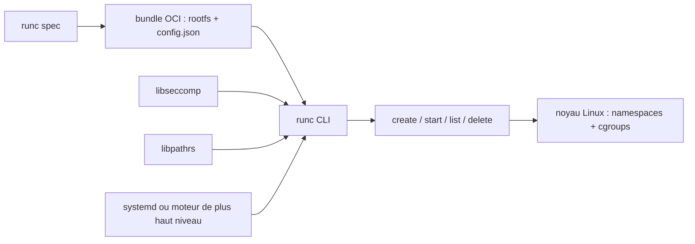

# opencontainers/runc

> **The Linux binary that actually starts a container, underneath the higher-level tools.**

## The problem

Starting a container means applying a set of kernel facilities — namespaces, cgroups, seccomp,
capabilities, SELinux, AppArmor — in the right order and without a hole. The README does not
spell that problem out; it assumes it, and simply says `runc` runs containers "according to
the OCI specification". Without a shared building block, every container engine would rewrite
that syscall plumbing its own way.

## What it actually does

`runc` is a CLI tool for spawning and running containers on Linux according to the OCI
specification — Linux only, the README states it explicitly.

It consumes an **OCI bundle**: a directory holding a `rootfs` and a `config.json`. `runc spec`
generates a base template spec you then edit; the fields are documented in the `runtime-spec`
repository, not here.

It offers two modes: the convenience command `run`, which creates, starts and deletes the
container once it exits; and the lifecycle operations — `create`, `start`, `list`, `delete` —
which let a higher-level system step in between creation and start (the README gives setting
up the container's network stack as the usual example).

It can also run without root privileges (`--rootless`), provided user namespaces are compiled
and enabled in the kernel, and it can be driven by a supervisor such as systemd (the README
ships a sample unit with `ExecStart` and `ExecStopPost`).

Optional features are selected through **build tags**: `seccomp` (syscall filtering via
`libseccomp`, on by default), `libpathrs` (path safety, on by default), `runc_nocriu`
(disables checkpoint/restore, off by default).

## How it is wired



No code-derived diagram exists for this repository, so the graph is inferred from the README
alone. The bundle is the input; `runc spec` bootstraps it; the lifecycle commands drive the
containerised process; `libseccomp` and `libpathrs` are linked at build time rather than
called by the user; and in practice a supervisor or a higher-level engine invokes `runc`,
not a human.

## Trying it

Commands copied from the README. Building:

```bash
apt update && apt install -y make gcc linux-libc-dev libseccomp-dev pkg-config git
cd github.com/opencontainers
git clone https://github.com/opencontainers/runc
cd runc

make
sudo make install
```

The binary lands in `/usr/local/sbin/runc`. Then the bundle and the run:

```bash
mkdir /mycontainer
cd /mycontainer
mkdir rootfs
docker export $(docker create busybox) | tar -C rootfs -xvf -
runc spec
runc run mycontainerid
```

Rootless variant:

```bash
runc spec --rootless
runc --root /tmp/runc run mycontainerid
```

Test suite: `make test`, which runs via Docker.

## Cost and traps

Free, Apache 2.0, no API key, no account. The cost sits elsewhere: you need Linux and a build
toolchain (`make`, `gcc`, kernel headers, `libseccomp-dev`, `pkg-config`, `git` — the README
lists the packages for Ubuntu/Debian, CentOS/Fedora and Alpine), plus a Go version at least
equal to the one in `go.mod`.

Two documented traps. `libpathrs`, enabled by default, is a Rust library that very few
distributions package: you usually have to build it yourself, at version 0.2.5 or above, with
Rust 1.63+; the project's own installation script is described as "completely unsupported" and
not intended for general use. And the only documented way to obtain a `rootfs` goes through
`docker export` on a `busybox` image pulled from a remote registry — hence Docker as a
prerequisite and a third-party dependency for the bootstrap example, even though `runc` itself
has none.

Rootless also requires `CONFIG_USER_NS=y` in the kernel, which is not a given everywhere, and
`runc run` without `--rootless` runs as root.

## What it is not

It is not a container engine for direct use: the README says so plainly — a low level tool,
not designed with an end user in mind, mostly employed by higher level container software, and
not recommended to use directly unless some specific use case prevents using Docker or Podman.

It is not an image builder either: `runc` cannot produce a `rootfs`, you must hand it one. It
does not manage container networking — the README hands that to whatever layer calls `create`
then `start`. There is no registry, no orchestration, no daemon. And none of it runs off Linux.

## Alternatives

- `opencontainers/runtime-spec`: not a competitor but the specification `runc` implements; the
  `config.json` fields are documented there, not in this repository.
- Docker and Podman, named by the README as what to prefer for direct use — `runc` is only the
  right pick when you are building the layer above yourself.
- Among the supplied neighbours, `docker/cli` is the only comparable one, and only loosely: it
  sits on the user side, where `runc` is the end of the chain. `anchore/grype`, `docker/buildx`
  and `google/go-containerregistry` cover vulnerability scanning, image building and registries
  — other floors of the same ecosystem, not replacements.

## For you

You are unlikely to invoke `runc` by hand on a data or MLOps platform: it is already running,
underneath the Docker or Kubernetes you use. The value is understanding where seccomp, cgroups
and rootless apply when a training job or an inference service misbehaves, and being able to
read an OCI `config.json`. Worth watching as a foundation component, not adopting as a daily
tool.
