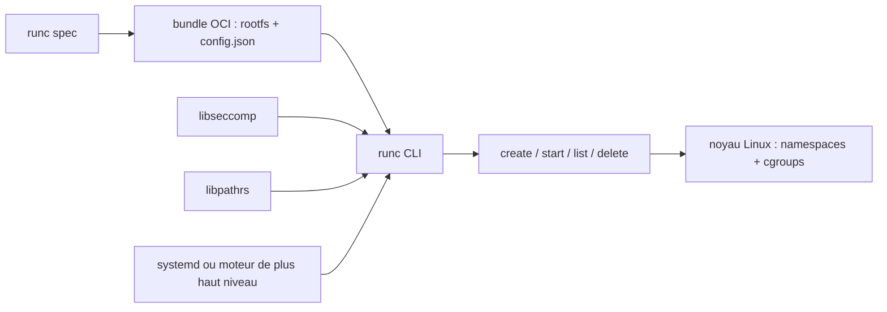

# opencontainers/runc

> **Le binaire Linux qui démarre réellement un conteneur, sous les outils de plus haut niveau.**

## Le problème

Lancer un conteneur, c'est appliquer un jeu de réglages noyau — namespaces, cgroups, seccomp,
capabilities, SELinux, AppArmor — dans le bon ordre et sans faille. Le README ne décrit pas ce
problème ; il le suppose, et se contente de dire que `runc` exécute des conteneurs « selon la
spécification OCI ». Sans une brique commune, chaque moteur de conteneurs réécrirait cette
mécanique d'appels système à sa façon.

## Ce que ça fait vraiment

`runc` est un outil en ligne de commande pour créer et exécuter des conteneurs sur Linux selon
la spécification OCI — Linux uniquement, le README l'écrit explicitement.

Il consomme un **bundle OCI** : un répertoire contenant un `rootfs` et un `config.json`.
`runc spec` génère un `config.json` de base, éditable, dont les champs sont documentés dans le
dépôt `runtime-spec`.

Il expose deux modes : la commande de confort `run`, qui crée, démarre puis supprime le
conteneur quand il sort ; et les opérations du cycle de vie — `create`, `start`, `list`,
`delete` — qui laissent un système de plus haut niveau intervenir entre la création et le
démarrage (le README cite le montage de la pile réseau à ce moment-là).

Il sait aussi tourner sans privilèges root (`--rootless`), à condition que les user namespaces
soient compilés et activés dans le noyau, et peut être piloté par un superviseur type systemd
(le README fournit une unité d'exemple avec `ExecStart` et `ExecStopPost`).

Les fonctionnalités optionnelles passent par des **build tags** : `seccomp` (filtrage d'appels
système via `libseccomp`, activé par défaut), `libpathrs` (sécurité des chemins, activé par
défaut), `runc_nocriu` (désactive checkpoint/restore, non activé par défaut).

## Comment c'est branché



Aucun diagramme tiré du code n'existe pour ce dépôt : ce schéma est déduit du seul README.
L'entrée est le bundle ; `runc spec` sert à l'amorcer ; les commandes du cycle de vie
pilotent la création puis l'arrêt du processus conteneurisé ; `libseccomp` et `libpathrs`
sont liés à la compilation et non appelés à l'exécution par l'utilisateur ; en pratique c'est
un superviseur ou un moteur de conteneurs qui invoque `runc`, pas un humain.

## Essayer

Commandes recopiées du README. Construction :

```bash
apt update && apt install -y make gcc linux-libc-dev libseccomp-dev pkg-config git
cd github.com/opencontainers
git clone https://github.com/opencontainers/runc
cd runc

make
sudo make install
```

Le binaire atterrit dans `/usr/local/sbin/runc`. Puis le bundle et l'exécution :

```bash
mkdir /mycontainer
cd /mycontainer
mkdir rootfs
docker export $(docker create busybox) | tar -C rootfs -xvf -
runc spec
runc run mycontainerid
```

Version sans root :

```bash
runc spec --rootless
runc --root /tmp/runc run mycontainerid
```

Tests : `make test`, qui passe par Docker.

## Coût et pièges

Gratuit, Apache 2.0, aucune clé d'API, aucun compte. Le coût est ailleurs : il faut un Linux
et une chaîne de compilation (`make`, `gcc`, en-têtes noyau, `libseccomp-dev`, `pkg-config`,
`git` — le README donne les paquets pour Ubuntu/Debian, CentOS/Fedora et Alpine), plus une
version de Go au moins égale à celle du `go.mod`.

Deux pièges documentés. `libpathrs`, activé par défaut, est une bibliothèque Rust que très peu
de distributions empaquettent : il faut souvent la compiler soi-même, en version 0.2.5 minimum,
avec Rust 1.63+ ; le script d'installation fourni par le projet est qualifié de
« complètement non supporté » et pas destiné à un usage général. Ensuite, le seul chemin
documenté pour obtenir un `rootfs` passe par `docker export` sur une image `busybox` tirée
d'un registre distant — d'où Docker en prérequis et la dépendance à un service tiers pour
l'exemple d'amorçage, même si `runc` lui-même n'en a aucune.

Enfin le rootless exige `CONFIG_USER_NS=y` dans le noyau, ce qui n'est pas acquis partout, et
`runc run` sans `--rootless` se lance en root.

## Ce que ce n'est pas

Ce n'est pas un moteur de conteneurs pour usage direct : le README l'écrit noir sur blanc —
outil bas niveau, pas conçu pour un utilisateur final, employé par des logiciels de conteneurs
de plus haut niveau, et non recommandé en usage direct sauf cas particulier qui empêcherait
d'utiliser Docker ou Podman.

Ce n'est pas non plus un constructeur d'images : `runc` ne sait pas fabriquer un `rootfs`, il
faut le lui fournir. Il ne gère pas le réseau du conteneur — le README renvoie ce travail à la
couche qui appelle `create` puis `start`. Il n'y a ni registre, ni orchestration, ni démon.
Et rien de tout cela ne tourne hors Linux.

## Alternatives

- `opencontainers/runtime-spec` : pas un concurrent mais la spécification que `runc` implémente ;
  c'est là que se lisent les champs du `config.json`, et non dans ce dépôt.
- Docker et Podman, cités par le README comme les outils qu'il faut préférer pour un usage
  direct — `runc` ne se choisit que si l'on construit soi-même la couche au-dessus.
- Parmi les voisins fournis, `docker/cli` est le seul comparable, et encore : il est côté
  utilisateur, là où `runc` est le bout de la chaîne. `anchore/grype`, `docker/buildx` et
  `google/go-containerregistry` traitent d'analyse de vulnérabilités, de construction d'images
  et de registres — d'autres étages du même écosystème, pas des remplaçants.

## Pour toi

Peu de chances d'invoquer `runc` à la main sur une plateforme data ou MLOps : il tourne déjà,
sous le Docker ou le Kubernetes que tu utilises. L'intérêt est de comprendre où s'appliquent
seccomp, les cgroups et le rootless quand un job d'entraînement ou un service d'inférence se
comporte mal, et de savoir lire un `config.json` OCI. À surveiller comme brique de socle, pas
à adopter comme outil quotidien.
