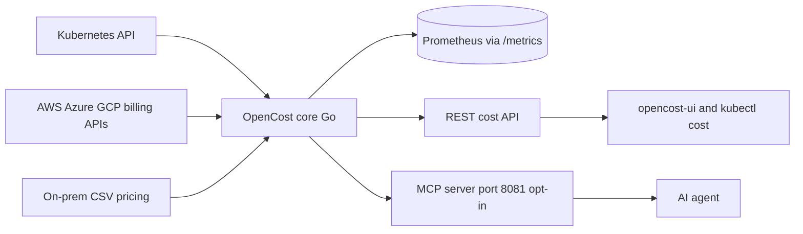

# opencost/opencost

> **Measures who spends what inside a Kubernetes cluster and across cloud providers.**

## The problem

Without it, a Kubernetes bill arrives aggregated per cloud account: you know what you pay, not
which team, namespace or pod consumed it. Internal chargeback becomes guesswork, and
overprovisioned resources stay invisible until the yearly audit.

## What it actually does

OpenCost pairs a **specification** (the `spec/` directory) with a Go implementation of it. It
allocates cost in real time by cluster, node, namespace, controller kind, controller, service or
pod, covering CPU, GPU, memory and persistent volumes. It queries the AWS, Azure and GCP billing
APIs for on-demand asset pricing, and accepts a custom CSV price list for on-prem clusters. Data
comes out through REST cost APIs, a Prometheus `/metrics` endpoint, and an MCP server (port 8081,
disabled by default) exposing four tools to AI agents: `get_allocation_costs`, `get_asset_costs`,
`get_cloud_costs` and `get_efficiency`, the last one returning rightsizing recommendations. The
README also states AI inference cost tracking for vLLM-based deployments: cost per million input
and output tokens, KV cache-corrected pricing, shared infrastructure attribution. Carbon costs and
external costs such as Datadog go through separate plugins. The web UI lives in the separate
`opencost/opencost-ui` repository.

## How it is wired



The Go core reads cluster state from Kubernetes and prices from the providers, then publishes the
same material through three doors: Prometheus metrics, the cost API, and the MCP server. The UI,
the `kubectl cost` CLI and AI agents are all consumers of those outputs, none of them shipped in
this repository.

## Trying it

```bash
helm repo add opencost https://opencost.github.io/opencost-helm-chart
helm repo update
helm install opencost opencost/opencost
```

With the MCP server enabled:

```bash
helm install opencost opencost/opencost --set opencost.mcp.enabled=true
kubectl port-forward svc/opencost 8081:8081
```

For development the README documents Tilt:

```bash
git clone https://github.com/opencost/opencost.git
cd opencost
tilt up
```

Standalone Kubernetes manifests have been removed; Helm is the only documented install and
upgrade path.

## Cost and traps

The software is free under Apache-2.0, but it assumes a Kubernetes 1.20+ cluster and a Prometheus
— that is the real entry cost. The README warns that with a sharded (HA) Prometheus you must point
`PROMETHEUS_SERVER_ENDPOINT` at a global query endpoint (Thanos Query, Cortex, Mimir), otherwise
exports are incomplete or intermittent. Dynamic pricing depends on the AWS/Azure/GCP billing APIs,
hence on provider credentials; without them you fall back to CSV pricing. Cloud cost ingestion is
explicitly opt-in (`CLOUD_COST_ENABLED`, `CLOUD_COST_CONFIG_PATH`). A practical trap the README
flags: the UI and Prometheus both listen on port 9090 under the Tilt setup. On `get_efficiency`, a
smaller `step` lowers peak memory but increases query time and request count.

## What it is not

It is not an automatic optimizer: it measures, and recommends through `get_efficiency`, but it
resizes and deletes nothing for you. It is not the web interface either — that lives in a separate
repository, as do the external cost connectors (Datadog) shipped as plugins. It is not a turnkey
product: the README keeps pointing to opencost.io and the Helm chart for actual configuration.
And the MCP server is deliberately off by default to minimize attack surface — do not expect it
without enabling it.

## Alternatives

The README names **Kubecost**, the vendor that originally developed and open sourced OpenCost and
sells the commercial version: worth it if you want support and features beyond the specification.
Among the supplied neighbours, **VictoriaMetrics** and **netdata** are monitoring, not cost
attribution, while **cilium** and **prowler** cover networking and compliance: no comparable
alternative in the catalogue for Kubernetes FinOps.

## For you

On a cluster running training or inference, this is the piece that puts a price on a GPU namespace
and makes budget conversations quantifiable. Per-million-token cost tracking for vLLM deployments
plus the MCP surface make it a direct candidate for an ML FinOps dashboard. Skip it if your
workloads are not on Kubernetes.
