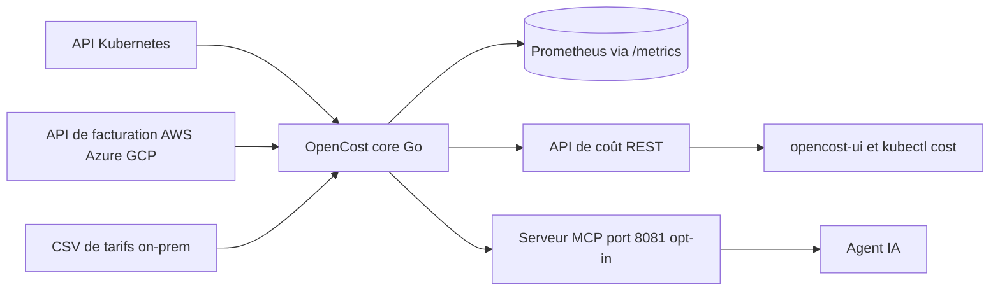

# opencost/opencost

> **Mesure qui dépense quoi dans un cluster Kubernetes et chez les fournisseurs cloud.**

## Le problème

Sans cet outil, une facture Kubernetes arrive agrégée par compte cloud : on sait ce qu'on paie,
pas quelle équipe, quel namespace ou quel pod l'a consommé. La refacturation interne se fait alors
à la louche, et les ressources surprovisionnées restent invisibles jusqu'à l'audit annuel.

## Ce que ça fait vraiment

OpenCost combine une **spécification** (dossier `spec/`) et une implémentation Go de celle-ci.
Il attribue en temps réel les coûts par cluster, nœud, namespace, type de contrôleur, contrôleur,
service ou pod, et couvre CPU, GPU, mémoire et volumes persistants. Il interroge les API de
facturation AWS, Azure et GCP pour tarifer dynamiquement les ressources à la demande, et accepte
un CSV de tarifs maison pour les clusters on-prem. Il expose ses données via des API REST, un
endpoint `/metrics` Prometheus, et depuis peu un serveur MCP (port 8081, désactivé par défaut)
qui donne à un agent IA quatre outils : `get_allocation_costs`, `get_asset_costs`,
`get_cloud_costs`, `get_efficiency` — ce dernier renvoyant des recommandations de rightsizing.
Le README annonce aussi un suivi du coût d'inférence IA pour les déploiements basés sur vLLM :
coût par million de tokens en entrée/sortie, tarification corrigée du cache KV, attribution de
l'infrastructure partagée. Les coûts carbone et les coûts externes type Datadog passent par des
plugins séparés. L'interface web n'est pas dans ce dépôt mais dans `opencost/opencost-ui`.

## Comment c'est branché



Le cœur Go lit l'état du cluster côté Kubernetes et les tarifs côté fournisseurs, puis publie la
même matière par trois portes : les métriques Prometheus, l'API de coût, et le serveur MCP.
L'UI, le CLI `kubectl cost` et les agents IA sont tous des consommateurs de ces sorties — aucun
n'est dans ce dépôt.

## Essayer

```bash
helm repo add opencost https://opencost.github.io/opencost-helm-chart
helm repo update
helm install opencost opencost/opencost
```

Avec le serveur MCP activé :

```bash
helm install opencost opencost/opencost --set opencost.mcp.enabled=true
kubectl port-forward svc/opencost 8081:8081
```

En développement, le README documente Tilt :

```bash
git clone https://github.com/opencost/opencost.git
cd opencost
tilt up
```

Les manifestes Kubernetes autonomes ont été supprimés : Helm est le seul chemin d'installation
et de mise à jour documenté.

## Coût et pièges

Le logiciel est gratuit sous Apache-2.0, mais il suppose un cluster Kubernetes 1.20+ et un
Prometheus : ce sont eux le vrai coût d'entrée. Le README avertit que sur un Prometheus shardé
en HA, il faut pointer `PROMETHEUS_SERVER_ENDPOINT` vers un endpoint de requête global (Thanos
Query, Cortex, Mimir) — sinon les exports sont incomplets ou intermittents. La tarification
dynamique dépend des API de facturation AWS/Azure/GCP, donc de credentials chez ces fournisseurs ;
sans elles, il reste le CSV de tarifs. L'ingestion des coûts cloud s'active explicitement
(`CLOUD_COST_ENABLED`, `CLOUD_COST_CONFIG_PATH`). Piège pratique signalé : l'UI et Prometheus
écoutent tous deux sur le port 9090 en configuration Tilt. Sur `get_efficiency`, un `step` plus
petit réduit le pic mémoire mais augmente le temps de requête et le nombre d'appels.

## Ce que ce n'est pas

Ce n'est pas un outil d'optimisation automatique : il mesure, il recommande via `get_efficiency`,
mais il ne redimensionne ni ne supprime rien à votre place. Ce n'est pas non plus l'interface
web — celle-ci vit dans un dépôt séparé, comme les connecteurs de coûts externes (Datadog) qui
sont des plugins. Ce n'est pas un produit clé en main : le README renvoie constamment vers
opencost.io et le chart Helm pour la configuration réelle. Enfin le serveur MCP est désactivé par
défaut, volontairement, pour limiter la surface d'attaque : ne comptez pas l'avoir sans l'activer.

## Alternatives

Le README nomme **Kubecost**, l'éditeur d'origine qui a open-sourcé OpenCost et en vend la version
commerciale : à considérer si vous voulez du support et des fonctions au-delà de la spécification.
Parmi les voisins proposés, **VictoriaMetrics** et **netdata** relèvent de la métrologie, pas de
l'attribution de coût, et **cilium** ou **prowler** traitent réseau et conformité : aucune
alternative comparable dans le catalogue sur le créneau du FinOps Kubernetes.

## Pour toi

Sur un cluster qui fait tourner de l'entraînement ou de l'inférence, c'est la brique qui met un
prix sur un namespace GPU et rend la discussion budgétaire chiffrable. Le suivi de coût par
million de tokens pour les déploiements vLLM et l'exposition MCP en font un candidat direct pour
un tableau de bord FinOps ML. À ignorer si vos charges ne sont pas sur Kubernetes.
