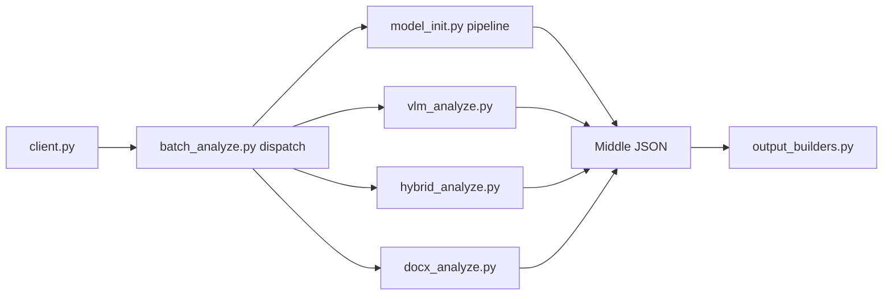

# opendatalab/MinerU

> Parseur local de documents (PDF, images, Office) en Markdown/JSON, utilisable en CLI, SDK, API ou par un agent.

## Le problème
Extraire proprement texte, tableaux et formules d'un PDF scanné ou d'un fichier Office pour un LLM ou un RAG donne souvent un texte désordonné.

## Ce que ça fait vraiment
Le CLI (`client.py`) oriente chaque document selon son format et le backend choisi : pipeline local (mise en page, OCR, formules, tableaux ; `model_init.py`), VLM (`vlm_analyze.py`), hybride texte natif + modèle (`hybrid_analyze.py`), ou analyseurs Office natifs (`docx_analyze.py`).
Toutes les voies convergent vers un « middle JSON » commun, que `output_builders.py` rend en Markdown, HTML, LaTeX, DOCX, etc. Quatre niveaux : Flash, Basic, Standard, Advanced.
La version 4.0 ajoute une bibliothèque documentaire locale (cache, recherche, lecture page par page avec localisateurs stables pour citer), un SDK Python, une API, une WebUI Gradio.

## Comment c'est branché


## Essayer
```bash
pip install uv
uv venv .mineru --python 3.12
source .mineru/bin/activate
uv pip install -U "mineru>=4.0,<5"
mineru-kit parse document.pdf -o document.md --tier standard
mineru-kit webui
```

## Coût et pièges
Gratuit ; fonctionne sur CPU (ONNX, llama.cpp Vulkan). `mineru[full]` pour les GPU NVIDIA. Docker pour matériel non NVIDIA en attente de mise à jour.

## Ce que ce n'est pas
Le README le dit : ni framework RAG, ni base vectorielle, ni appli de chat avec les documents. `mineru parse --json` s'arrête par défaut aux 10 premières pages. Rien n'est envoyé au service officiel sans configuration explicite.

## Alternatives
Aucune alternative nommée dans le README.

## Pour toi
À adopter en tête de tes pipelines RAG et d'extraction documentaire.
