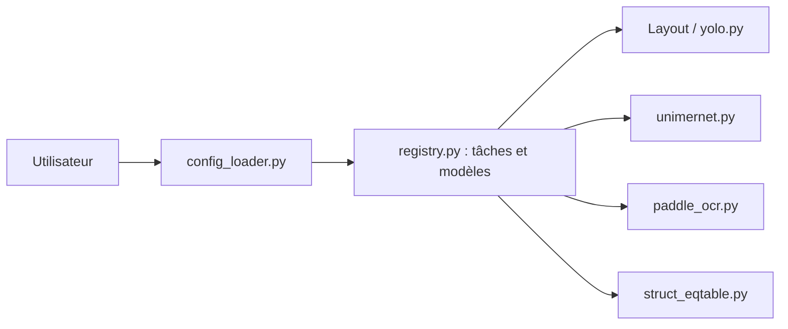

# opendatalab/PDF-Extract-Kit

> Boîte à outils de modèles pour extraire contenu, formules, tableaux et texte de PDF complexes.

## Le problème
Les PDF scientifiques ou financiers mêlent colonnes, formules et tableaux, difficiles à lire pour un extracteur de texte simple.

## Ce que ça fait vraiment
Assemble des modèles : détection de mise en page (DocLayout-YOLO, YOLO-v10, LayoutLMv3), détection de formules (YOLOv8), reconnaissance de formules (UniMERNet), OCR (PaddleOCR) et tableaux (StructEqTable, TableMaster). Chaque tâche se lance par script et fichier de configuration. Une application d'exemple convertit un PDF en Markdown ; le README oriente vers MinerU pour cet usage.

## Comment c'est branché


## Essayer
```bash
conda create -n pdf-extract-kit-1.0 python=3.10
conda activate pdf-extract-kit-1.0
pip install -r requirements.txt
python scripts/layout_detection.py --config=configs/layout_detection.yaml
python scripts/ocr.py --config=configs/ocr.yaml
```

## Coût et pièges
Gratuit. Il faut télécharger les poids de modèles (Hugging Face ou ModelScope) ; un GPU est conseillé (variante `requirements-cpu.txt` sinon). Licence AGPL-3.0.

## Ce que ce n'est pas
Pas un convertisseur PDF vers Markdown clé en main (c'est MinerU) ; la section d'évaluation est « Coming Soon ». Dernier push en janvier 2025.

## Alternatives
- MinerU : outil complet de conversion bâti sur ce kit.
- UniMERNet : algorithme de reconnaissance de formules.

## Pour toi
À surveiller : intéressant pour des PDF techniques dans un pipeline RAG, mais lourd (GPU, poids) et peu actif ; MinerU est plus direct.

