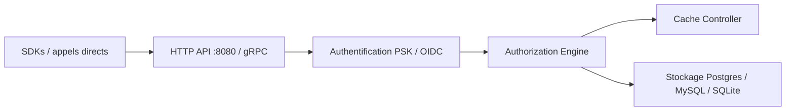

# openfga/openfga

> Moteur d'autorisation fine inspiré de Google Zanzibar, pour développeurs qui modélisent des droits d'accès.

## Le problème
Coder à la main des règles de droits (qui peut voir ou modifier quoi) devient ingérable dès que les relations se multiplient.

## Ce que ça fait vraiment
Un serveur exposant des API HTTP (8080) et gRPC : on écrit un modèle d'autorisation, on enregistre des tuples de relations, puis on pose des questions de vérification. Stockage en mémoire (développement seulement), PostgreSQL 14+, MySQL 8, SQLite (bêta). SDK Java, Node.js, Go, Python, .NET ; CLI, fournisseur Terraform, bac à sable local.

## Comment c'est branché


## Essayer
```bash
docker run -p 8080:8080 -p 3000:3000 openfga/openfga run
curl -X POST 'localhost:8080/stores' --header 'Content-Type: application/json' --data-raw '{"name": "openfga-demo"}'
```

## Coût et pièges
Gratuit. Le stockage mémoire par défaut perd tout à l'arrêt. Le bac à sable est réservé au local. Les limites de longueur de tuples sont plus strictes sous MySQL.

## Ce que ce n'est pas
Pas un service d'authentification (identité, connexion) : il décide des droits, il ne gère pas les comptes.

## Alternatives
Aucune alternative nommée dans le README.

## Pour toi
À surveiller : pertinent si tu construis une plateforme ou une appli de données avec droits par objet ; superflu pour un simple contrôle par rôle.

