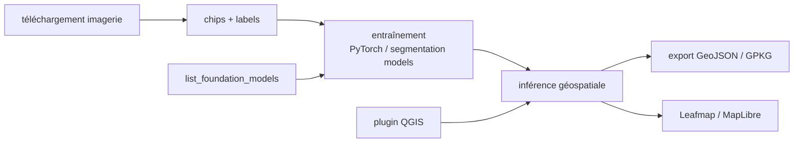

# opengeos/geoai

> Paquet Python qui relie apprentissage profond et données géospatiales, pour chercheurs et praticiens SIG.

## Le problème
Appliquer du deep learning à de l'imagerie satellite impose de coudre des écosystèmes séparés :
librairies ML généralistes d'un côté, outils géospatiaux de l'autre.
Le prétraitement (chips, labels, reprojection) est refait à chaque projet.

## Ce que ça fait vraiment
Six capacités : recherche et téléchargement d'imagerie (Sentinel, Landsat, NAIP, Overture Maps),
préparation automatisée de jeux d'entraînement (chips + labels), entraînement classification /
détection / segmentation, pipelines d'inférence, visualisation via Leafmap et MapLibre, plugin QGIS.
Catalogue de 20 modèles de fondation en télédétection : `list_foundation_models()`,
`get_foundation_model_info()`, `load_foundation_model()` (backbones TerraTorch).
Formats GeoTIFF, JPEG2000, GeoJSON, Shapefile, GeoPackage, GeoParquet ; gestion automatique du device.

## Comment c'est branché


## Essayer
```bash
pip install geoai-py
conda install -c conda-forge geoai
mamba install -c conda-forge geoai
```

## Coût et pièges
Gratuit. Accélération GPU si disponible, sinon CPU. Les sources d'imagerie peuvent exiger des comptes
côté fournisseur ; le README ne le détaille pas. Recherche partiellement financée par la NASA et l'USGS.

## Ce que ce n'est pas
Ce n'est pas un moteur bas niveau : c'est une couche haut niveau au-dessus de PyTorch, Transformers,
segmentation models et torchange. Ce n'est pas un SIG complet ni un remplaçant de QGIS.
Le catalogue de modèles de fondation est repris d'une liste externe, pas entraîné ici.

## Alternatives
TorchGeo, TerraTorch et SRAI, cités comme excellentes bases bas niveau, moins « haut niveau » que geoai.

## Pour toi
Le raccourci crédible si tu dois sortir des emprises de bâtiments ou une classif d'occupation du sol.
