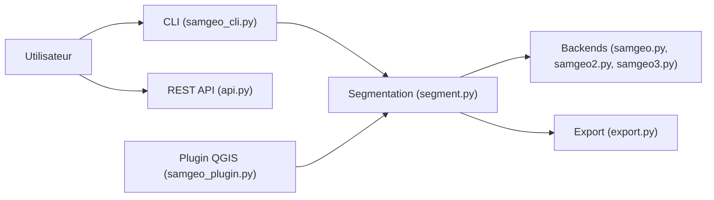

# opengeos/segment-geospatial

> Paquet Python qui applique Segment Anything à l'imagerie géospatiale, avec CLI, API REST et plugin QGIS.

## Le problème
Appliquer SAM à des GeoTIFF exige de gérer tuiles, géoréférencement et export vectoriel autour du modèle.

## Ce que ça fait vraiment
Il télécharge des tuiles TMS vers GeoTIFF, segmente avec SAM, SAM 2, SAM 3, FastSAM ou HQ-SAM, accepte invites par points, boîtes ou texte (Grounding DINO), traite des séries temporelles, enregistre en GeoPackage, Shapefile ou GeoJSON, et affiche sur cartes interactives. Il offre aussi une CLI Click, une API REST FastAPI et un plugin QGIS qui installe ses dépendances.

## Comment c'est branché


## Essayer
```bash
pip install "segment-geospatial[samgeo3]"
conda install -c conda-forge segment-geospatial
pixi init geo && cd geo && pixi install
```

## Coût et pièges
Gratuit ; un GPU d'au moins 8 Go est recommandé, Colab possible. L'installation de SAM 3 sous Windows est délicate. Tu dois obtenir l'accord du fournisseur de fond de carte avant un téléchargement massif de tuiles.

## Ce que ce n'est pas
Pas un modèle entraîné par le projet : il enrobe SAM et ses variantes. Le README précise un usage éducatif, à tes risques.

## Alternatives
Non documenté dans le README (cite segment-anything-eo comme origine, et la boîte à outils SAM d'ArcGIS).

## Pour toi
Pertinent si tu fais de la vision sur imagerie satellite ou aérienne : segmentation par texte prête à l'emploi ; prévois un GPU.

