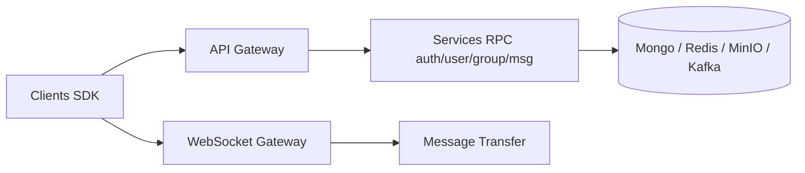

# openimsdk/open-im-server

> Serveur de messagerie instantanée open source, à intégrer dans ses propres applications, pour développeurs.

## Le problème
Ajouter du chat à une application oblige à bâtir envoi, groupes et utilisateurs, ou à dépendre d'un service tiers.

## Ce que ça fait vraiment
Un serveur en microservices Go (passerelle, services RPC) avec un SDK client. Il gère messages, utilisateurs, amis, groupes, conversations ; API REST pour le métier et webhooks avant/après événements. Revendique des groupes de centaines de milliers d'utilisateurs (affirmation du README). D'après le code : MongoDB, Redis, MinIO, Kafka et etcd en arrière-plan.

## Comment c'est branché

## Essayer
Le README renvoie à des guides de déploiement (source, Docker) : aucune commande présente.

## Coût et pièges
Stack lourde (Mongo, Redis, Kafka, MinIO) à héberger. Documentation d'installation externe.

## Ce que ce n'est pas
Ce n'est pas une application de chat installable : le README le dit explicitement, c'est une base pour développeurs, comparée à Telegram, Signal, Rocket.Chat.

## Alternatives
Telegram, Signal et Rocket.Chat sont cités comme applications autonomes, pas comme équivalents.

## Pour toi
À surveiller : pertinent seulement si tu dois embarquer un chat dans un produit ; peu utile pour un travail data/MLOps.

