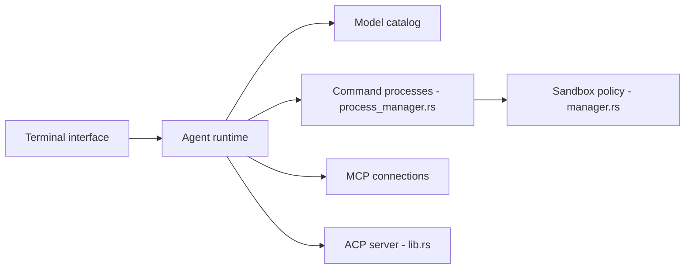

# openinterpreter/openinterpreter

> Agent de code en terminal, réécrit en Rust sur Codex, qui émule plusieurs harnais d'agents.

## Le problème
Les modèles bon marché rendent moins bien que les modèles phares ; le harnais d'agent qui les entoure fait une grande part de la différence.

## Ce que ça fait vraiment
Fork d'OpenAI Codex en Rust. `/harness` bascule entre des harnais émulés (claude-code, kimi-code, qwen-code, deepseek-tui, swe-agent, minimal…), `/model` change de fournisseur. Exécute les commandes dans un bac à sable natif, parle ACP pour les éditeurs et le protocole `exec` de Codex (SDK compatible), lit `AGENTS.md` et `.agents/skills`, supporte MCP, hooks et permissions. Une skill QA pilote des interfaces web ou natives.

## Comment c'est branché


## Essayer
```bash
curl -fsSL https://www.openinterpreter.com/install | sh
interpreter
interpreter acp
```

## Coût et pièges
Gratuit, mais il faut un fournisseur de modèle avec sa clé et sa facture. Installation par script piped en shell : à lire avant d'exécuter.

## Ce que ce n'est pas
Pas le projet Python d'origine : celui-ci survit en fork communautaire (endolith/open-interpreter). Les graphes signalent que le câblage runtime n'a pas été échantillonné.

## Alternatives
- endolith/open-interpreter : version Python d'origine, maintenue par la communauté.

## Pour toi
À surveiller : intéressant pour tester des modèles peu chers avec un harnais éprouvé, mais jeune et très dépendant des fournisseurs de modèles.

