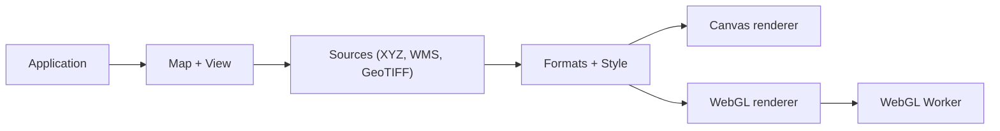

# openlayers/openlayers

> Bibliothèque JavaScript pour afficher des cartes interactives dans une page web, pour développeurs front.

## Le problème
Afficher des tuiles, des données vectorielles et des marqueurs venus de sources variées sur une carte web, avec projections et interactions, demande beaucoup de code sur mesure.

## Ce que ça fait vraiment
Une carte (`Map`) et une vue (`View`) combinent des couches et des sources (XYZ, OSM, WMTS, WMS, tuiles vectorielles, GeoTIFF). Les données passent par des modules de format, sont stylées, puis rendues par Canvas ou WebGL. Un worker WebGL existe dans `src/ol/worker/webgl.js`. Le paquet est modulaire.

## Comment c'est branché


## Essayer
```bash
npm install ol
```

## Coût et pièges
Gratuit. Les fonds de carte (ex. tuiles OpenStreetMap dans l'exemple) dépendent de services tiers avec leurs propres conditions.

## Ce que ce n'est pas
Pas un service de cartographie ni un SIG serveur : c'est une bibliothèque côté navigateur, sans données fournies. 851 issues ouvertes.

## Alternatives
Aucune alternative nommée dans le README.

## Pour toi
Surveiller : utile si un tableau de bord géospatial l'exige, mais hors du cœur data/IA/MLOps.

