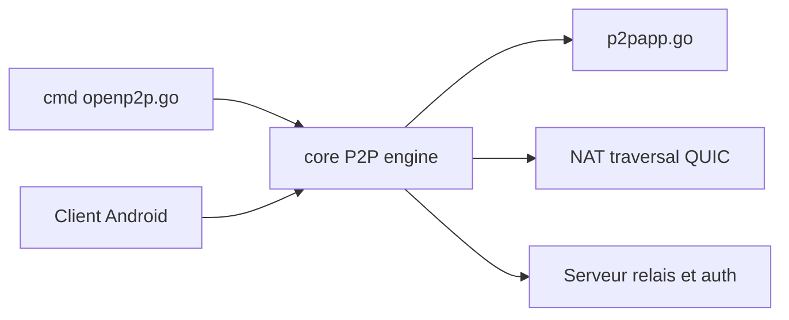

# openp2p-cn/openp2p

> Réseau P2P de partage de bande passante pour accéder à ses machines à distance sans IP publique.

## Le problème
Joindre un PC, un NAS ou un serveur dans un réseau privé sans serveur à IP publique ni abonnement.

## Ce que ça fait vraiment
Un client Go léger (10 Mo) crée des tunnels P2P (perçage NAT, UDP/TCP, QUIC, UPnP, IPv6) entre tes appareils, avec repli sur des relais partagés. Le concept central est le P2PApp : un service distant (RDP, SSH) mappé sur un port local. Canal TLS 1.3 avec chiffrement AES en plus ; les relais s'authentifient par TOTP. Un client Android existe. L'usage des relais publics exige de partager ses propres nœuds (10 Mbps par défaut).

## Comment c'est branché


## Essayer
```bash
make
CGO_ENABLED=0 env GOOS=linux GOARCH=amd64 go build -o openp2p --ldflags '-s -w ' -gcflags '-l' -p 8 -installsuffix cgo ./cmd
```

## Coût et pièges
Gratuit, mais compte par e-mail sur le service d'orchestration et contribution de bande passante. Windows peut bloquer l'exécutable non signé. Go 1.20 exigé.

## Ce que ce n'est pas
Pas un VPN d'entreprise audité. Le README avertit qu'un relais est un homme du milieu, d'où le chiffrement AES.

## Alternatives
Aucune alternative nommée dans le README.

## Pour toi
À ignorer : accès distant grand public, avec dépendance à un service de relais tiers ; pour un cluster GPU, préfère un accès contrôlé.

