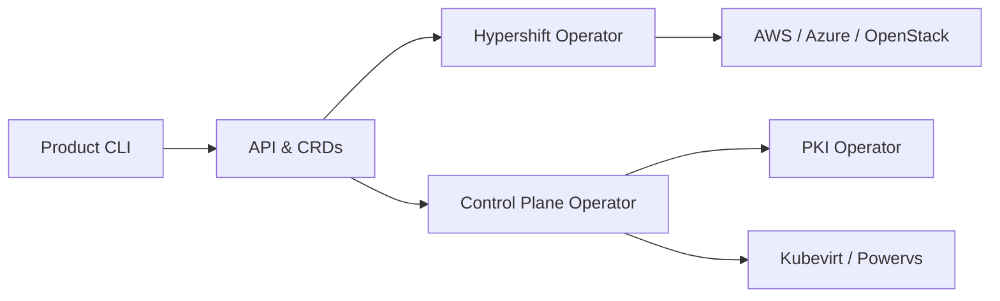

# openshift/hypershift

> Intergiciel qui héberge les plans de contrôle OpenShift à grande échelle, pour des équipes plateforme.

## Le problème
Un plan de contrôle OpenShift par cluster coûte cher et met du temps à provisionner. Séparer gestion et charges de travail est difficile.

## Ce que ça fait vraiment
Le README tient en quelques lignes : il annonce des plans de contrôle hébergés, portables entre clouds, et des clusters compatibles OCP et Kubernetes. Le détail vient de l'architecture : des CRD pilotent des opérateurs (control-plane-operator, hypershift-operator, PKI, karpenter) qui provisionnent chez AWS, Azure, OpenStack, PowerVS, Kubevirt. Le reste est renvoyé à la documentation.

## Comment c'est branché


## Essayer
```bash
# Aucune commande documentée dans le README : voir la documentation en ligne.
```

## Coût et pièges
Suppose un cluster de gestion Kubernetes/OpenShift et des comptes cloud. Facture cloud à ta charge ; le README ne chiffre rien.

## Ce que ce n'est pas
Ce n'est pas un outil pour un usage data/IA isolé : c'est de l'infrastructure de plateforme. README trop court pour évaluer install ou limites.

## Alternatives
Aucune alternative nommée dans le README.

## Pour toi
Ignorer : c'est de la plomberie OpenShift multi-tenant, hors du périmètre data/MLOps courant, et le README ne donne rien à tester.
