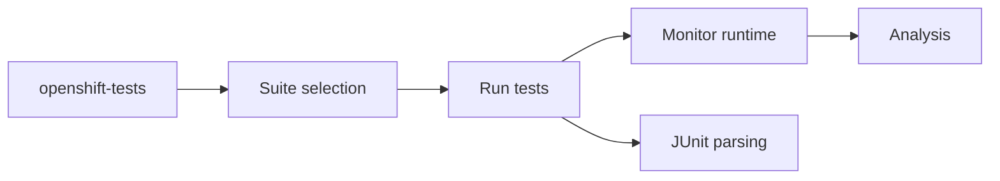

# openshift/origin

> Dépôt Red Hat qui maintient le binaire de tests `openshift-tests` (e2e) pour les clusters OpenShift/OKD.

## Le problème
Valider qu'un cluster OpenShift se comporte correctement demande une batterie de tests e2e et un suivi des perturbations. Ce dépôt les regroupe.

## Ce que ça fait vraiment
Depuis les branches 4.6+, il ne produit plus `hyperkube` (passé à `openshift/kubernetes`) : il ne maintient que `openshift-tests`. Le binaire choisit des suites, les exécute, et des moniteurs enregistrent le comportement du cluster. Il contient aussi de l'analyse d'alertes, de risque e2e et un parseur JUnit.

## Comment c'est branché


## Essayer
```bash
make
hack/update-kube-vendor.sh <openshift/kubernetes branch name or SHA>
```
Pour lancer une suite précise : lire `test/extended/README`.

## Coût et pièges
Il faut un cluster OpenShift à tester ; le vendoring depuis `openshift/kubernetes` est temporaire et peut échouer en « 410 Gone » (contournement `GOSUMDB=off`).

## Ce que ce n'est pas
Ce n'est plus le dépôt de Kubernetes pour OKD ni de `hyperkube`. Ce n'est pas un outil utilisable sans cluster OpenShift.

## Alternatives
Aucune alternative nommée dans le README.

## Pour toi
À ignorer en data/MLOps sauf si tu opères ou qualifies des clusters OpenShift : c'est de l'outillage interne de test de plateforme.

