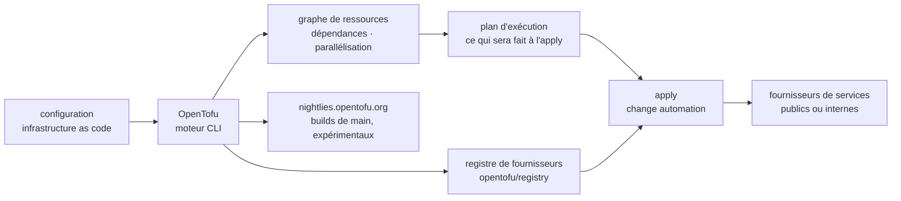

# opentofu/opentofu

> **Open-source infrastructure-as-code engine, for teams that describe and version their resources.**

## The problem

Without a tool of this kind, the state of an infrastructure lives in web consoles, homemade
scripts and operators' memories: nothing is reviewed, nothing is replayed identically, and
nobody knows before acting what a change is about to destroy. The README also implies a
governance problem: OpenTofu exists as a freely licensed tool in an ecosystem where the
equivalent changed licence terms — though the README itself says nothing beyond "OSS" and
MPL-2.0.

## What it actually does

The README claims four capabilities and nothing more. **Infrastructure as code**: resources
are described in a high-level configuration syntax that can be versioned, shared and reused
like any other code. **Execution plans**: a "planning" step computes and shows what the tool
will do when you call apply, before anything is touched. **Resource graph**: dependencies
between resources are built into a graph, and non-dependent creations or modifications are
parallelised, which also gives operators visibility into those dependencies. **Change
automation**: complex changesets are applied with minimal human interaction, the order being
determined by the plan and the graph.

What OpenTofu does not do itself: talk to cloud providers. The README says it manages existing
service providers as well as custom in-house solutions, through an external registry (the
`opentofu/registry` repository, cited for its inclusion policy). This repository is the
engine; providers are plugins distributed alongside it.

## How it is wired



No code-derived diagram exists for this repository: this one is reconstructed from the README
alone, and therefore names no real source file. The point to keep is the split between the
engine (this repository) and the provider registry (`opentofu/registry`, a separate repository
with its own access policy).

## Trying it

```
No installation or usage command is documented in the README.
It points to an external page: https://opentofu.org/docs/intro/install
```

The only technical entry point the README gives is nightly builds, available at
`https://nightlies.opentofu.org/nightlies`, with
`https://nightlies.opentofu.org/nightlies/latest.json` kept up to date for automation. The
README states that these builds are experimental, not intended for production use, and removed
after 30 days. Nothing is reconstructed here: the `init` / `plan` / `apply` commands one would
expect are not written in this README.

## Cost and traps

- **MPL-2.0 licence**: file-level copyleft. No consequence for simply running the binary,
  worth reading before integrating or modifying repository code into a distributed product.
  This is the reason for the single alert.
- **Registry access blocked by country**: the README explicitly announces that access is
  blocked from specific countries of origin, to comply with applicable sanctions, and points to
  the registry inclusion policy. That is an external availability dependency to check against
  wherever CI runners live.
- **The real cost is not the tool, it is the resources it creates.** The README mentions
  neither price nor quota: OpenTofu is free, the bill arrives from the providers it drives, and
  a poorly reviewed apply raises it.
- **Nightly builds are not a distribution channel**: experimental, purged after 30 days, cut
  from `main`.
- **The README documents no prerequisites, no state file format, no secret handling.** All of
  that is outside the README and must be looked up on the website.

## What it is not

- **It is not a managed service**: no SaaS, no account, no remote execution announced in the
  README. It is a tool you run yourself.
- **It is not a provider catalogue**: the engine is here, providers come from the registry
  (`opentofu/registry`), a separate repository with its own inclusion policy and a geographic
  block.
- **It is not a machine configuration tool**: it creates, changes and versions resources; what
  runs inside them is not its subject, and the README does not discuss it.
- **It is not a guarantee against surprises**: the plan shows what the tool *intends* to do;
  the README sells the absence of surprises at apply time, not the accuracy of the real world
  between the plan and its application.

## Alternatives

No comparable alternative in the catalogue: the batch line proposes no neighbour for this
repository, and the README names no competing tool — the only repositories it cites are
`opentofu/registry` and `opentofu/brand-artifacts`, which are parts of the same project rather
than replacements. Any comparison with another infrastructure-as-code engine would go beyond
the material available here.

## For you

This matters as soon as a data or training platform outgrows a single machine: warehouse,
storage buckets, queues, GPU clusters, access rights — all described once and replayed instead
of re-clicked. The execution plan is the central argument for an MLOps profile: read what is
going to be destroyed before applying it. Skip it if the infrastructure amounts to two managed
services created by hand, or if the team is already committed to another engine: the switching
cost is the state migration, a subject absent from this README.
