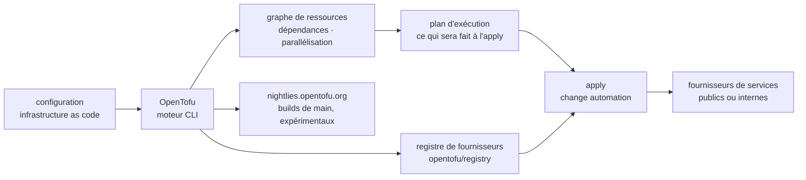

# opentofu/opentofu

> **Moteur d'infrastructure comme code sous licence libre, pour qui décrit et versionne ses ressources.**

## Le problème

Sans outil de ce type, l'état d'une infrastructure vit dans des consoles web, des scripts
maison et la mémoire des opérateurs : rien n'est relu en revue, rien n'est rejoué à
l'identique, et personne ne sait avant d'agir ce qu'une modification va détruire. Le README
pose aussi un problème de gouvernance : OpenTofu existe comme outil libre là où l'écosystème
équivalent a changé de conditions de licence — mais ce point n'est pas explicité dans le
README lui-même, qui se contente d'annoncer « OSS » et la MPL-2.0.

## Ce que ça fait vraiment

Le README annonce quatre capacités et rien d'autre. **Infrastructure comme code** : les
ressources sont décrites dans une syntaxe de configuration de haut niveau, versionnable,
partageable et réutilisable comme n'importe quel code. **Plans d'exécution** : une étape de
« planification » calcule et affiche ce que l'outil fera au moment de l'`apply`, avant de
toucher quoi que ce soit. **Graphe de ressources** : les dépendances entre ressources sont
construites en graphe, et les créations ou modifications indépendantes sont parallélisées, ce
qui donne aussi aux opérateurs une vue des dépendances. **Automatisation des changements** :
un ensemble de modifications s'applique avec une intervention humaine réduite, l'ordre étant
déterminé par le plan et le graphe.

Ce qu'OpenTofu ne fait pas lui-même : parler aux fournisseurs de cloud. Le README indique
qu'il « gère » les fournisseurs de services existants comme les solutions internes, via un
registre externe (dépôt `opentofu/registry`, cité pour sa politique d'inclusion). Le code du
dépôt est le moteur ; les fournisseurs sont des greffons distribués à côté.

## Comment c'est branché



Aucun diagramme tiré du code n'existe pour ce dépôt : ce schéma est reconstruit depuis le seul
README, et n'y figure donc aucun nom de fichier réel. Le point à retenir est la séparation
entre le moteur (ce dépôt) et le registre de fournisseurs (`opentofu/registry`, dépôt distinct
avec sa propre politique d'accès).

## Essayer

```
Aucune commande d'installation ni d'usage n'est documentée dans le README.
Il renvoie vers une page externe : https://opentofu.org/docs/intro/install
```

Le seul point d'entrée technique donné par le README est celui des builds nocturnes, à
récupérer sur `https://nightlies.opentofu.org/nightlies`, avec
`https://nightlies.opentofu.org/nightlies/latest.json` tenu à jour pour l'automatisation. Le
README précise que ces builds sont expérimentaux, non destinés à la production, et supprimés
au bout de 30 jours. Rien n'est reconstruit ici : les commandes `init` / `plan` / `apply`
qu'on attendrait ne sont pas écrites dans ce README.

## Coût et pièges

- **Licence MPL-2.0** : copyleft de fichier. Sans effet pour qui se contente d'exécuter le
  binaire, à lire avant d'intégrer ou de modifier du code du dépôt dans un produit distribué.
  C'est la raison de l'unique alerte.
- **Accès au registre bloqué par pays** : le README annonce explicitement un blocage d'accès
  depuis certains pays d'origine, au titre des sanctions applicables, avec renvoi vers la
  politique d'inclusion du registre. C'est une dépendance de disponibilité externe à vérifier
  selon l'endroit d'où tournent les agents de CI.
- **Le coût réel n'est pas l'outil, ce sont les ressources créées.** Le README ne parle ni de
  prix ni de quota : OpenTofu est gratuit, la facture arrive chez les fournisseurs qu'il
  pilote, et un `apply` mal relu la fait monter.
- **Les builds nocturnes ne sont pas un canal de distribution** : expérimentaux, purgés après
  30 jours, tirés de `main`.
- **Le README ne documente ni prérequis, ni format de fichier d'état, ni gestion des secrets.**
  Tout cela est hors README et à chercher sur le site.

## Ce que ce n'est pas

- **Ce n'est pas un service géré** : pas de SaaS, pas de compte, pas d'exécution distante
  annoncée dans le README. C'est un outil qu'on lance soi-même.
- **Ce n'est pas un catalogue de fournisseurs** : le moteur est ici, les fournisseurs viennent
  du registre (`opentofu/registry`), dépôt distinct avec sa propre politique d'inclusion et un
  blocage géographique.
- **Ce n'est pas un outil de configuration de machines** : il crée, modifie et versionne des
  ressources ; ce qui tourne à l'intérieur n'est pas son objet, et le README n'en parle pas.
- **Ce n'est pas une garantie d'absence de surprise** : le plan montre ce que l'outil *prévoit*
  de faire ; le README vend l'absence de surprises au moment de l'`apply`, pas l'exactitude du
  monde réel entre le plan et son application.

## Alternatives

Aucune alternative comparable dans le catalogue : la ligne de lot ne propose aucun voisin pour
ce dépôt, et le README ne nomme aucun outil concurrent — les seuls dépôts qu'il cite sont
`opentofu/registry` et `opentofu/brand-artifacts`, qui sont des composants du même projet, pas
des remplaçants. Toute comparaison avec un autre moteur d'infrastructure comme code sortirait
de la matière disponible ici.

## Pour toi

Ça compte dès qu'une plateforme de données ou d'entraînement dépasse la machine unique :
entrepôt, seaux de stockage, files, clusters GPU, droits d'accès — tout cela se décrit une
fois et se rejoue, au lieu de se recliquer. Le plan d'exécution est l'argument central pour un
profil MLOps : relire avant d'appliquer ce qui va être détruit. À écarter si l'infrastructure
tient en deux services gérés créés à la main, ou si l'équipe est déjà engagée sur un autre
moteur : le coût de bascule est celui de la migration de l'état, sujet absent du README.
