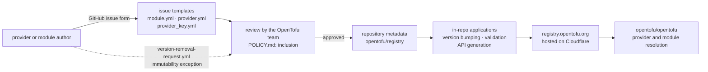

# opentofu/registry

> **Metadata and tooling behind OpenTofu's provider and module registry, fed through GitHub issue forms.**

## The problem

Without a registry, OpenTofu users have no canonical place to resolve a provider or a module by
name and version, and no way to check the GPG key that signs a provider. Every team would be
left pinning download URLs by hand and handling binary trust on its own.

## What it actually does

This repository holds the **metadata** that drives OpenTofu's provider and module registry, not
the providers themselves. It also contains the applications that handle version bumping,
validation and API generation for the registry hosted at `registry.opentofu.org`.

Adding a provider, a module or a GPG signing key goes through a **GitHub issue** opened from one
of the three templates the repository ships (`module.yml`, `provider.yml`, `provider_key.yml`).
The OpenTofu team then reviews the submission and approves or denies it. The README is emphatic:
submissions must go through the issue form UI — no pull requests, no `gh` CLI, no GitHub API
calls — or they will be closed unprocessed, because the automated validation pipeline depends on
the structured data only the form produces.

Published versions are treated as **immutable**: the registry generally does not remove them. A
version immutability policy (`POLICY.md#version-immutability`) describes the rare exceptions, and
a dedicated issue template (`version-removal-request.yml`) is how you request one. A separate
inclusion policy (`POLICY.md`) states who gets in.

## How it is wired



No code-derived diagram exists for this repository: the graph above is reconstructed from the
README alone. Node names reuse the only files it cites (`POLICY.md`, `CONTRIBUTING.md`, the three
issue templates); the actual Go source tree is not described there.

## Trying it

```bash
# The README documents no command at all: no install, no build, no local run.
# The only path it describes goes through the GitHub web UI, and it explicitly
# forbids creating these issues with the `gh` CLI or the GitHub API.
```

In plain words: open `github.com/opentofu/registry`, click the "Submit new Module", "Submit new
Provider" or "Submit new Provider Signing Key" link from the README, fill in the required fields,
submit, and wait for review. For code contributions the README points to `CONTRIBUTING.md`, which
is not reproduced here.

## Cost and gotchas

- **Free, nothing to install** on the consumer side: the registry is a public service, and the
  README thanks Cloudflare for sponsoring the Business plan hosting it.
- **A GitHub account is required** for any submission, since the issue form is the only channel.
- **The channel is rigid**: PRs, `gh` CLI and API calls are refused and closed. Homegrown
  automation around submissions will not work.
- **Human review latency** is not quantified in the README: approval or denial by the OpenTofu
  team, with no announced turnaround.
- **Version immutability**: a version published by mistake (a leaked secret, a broken artifact)
  cannot simply be pulled; it goes through the exception process.
- **Nothing is said** about registry API quotas, availability, or what to do when
  `registry.opentofu.org` is down.

## What it is not

- **It is not OpenTofu.** The engine lives in `opentofu/opentofu`; this repo is metadata and
  registry plumbing.
- **It is not an artifact mirror**: it stores neither provider binaries nor module source, only
  what is needed to reference them and verify their signatures.
- **It is not a documented self-hostable registry**: the README says nothing about running your
  own instance, and the entry point it describes is the public service.

## Alternatives

The README names only one other repository, `opentofu/opentofu`, which consumes the registry
rather than replacing it. The catalogue neighbours (`mermaid-js/mermaid`, `Z4nzu/hackingtool`,
`nwjs/nw.js`, `philc/vimium`) have nothing to do with infrastructure provider distribution:
**no comparable alternative in the catalogue**.

## For you

Little direct value for a data / AI profile: this is infrastructure-as-code ecosystem plumbing,
not a daily tool. Worth watching only if you provision your ML platform with OpenTofu rather than
Terraform — in which case the immutability policy and the issue-form submission channel are two
rules to know before publishing an internal module.
