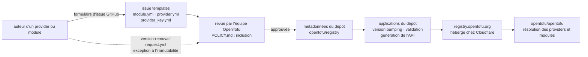

# opentofu/registry

> **Les métadonnées et l'outillage du registre de providers et modules d'OpenTofu, alimentés par formulaires GitHub.**

## Le problème

Sans registre, un utilisateur d'OpenTofu n'a aucun endroit canonique où résoudre un provider
ou un module par son nom et sa version, ni aucun moyen de vérifier la clé GPG qui signe un
provider. Chaque équipe en serait réduite à épingler des URL de téléchargement à la main et à
gérer elle-même la confiance dans les binaires.

## Ce que ça fait vraiment

Ce dépôt héberge les **métadonnées** qui pilotent le registre de providers et de modules
d'OpenTofu, et non les providers eux-mêmes. Il contient aussi les applications qui gèrent la
montée de version (*version bumping*), la validation et la génération de l'API du registre
publié sur `registry.opentofu.org`.

L'ajout d'un provider, d'un module ou d'une clé de signature GPG passe par une **issue GitHub**
créée depuis l'un des trois formulaires fournis par le dépôt (`module.yml`, `provider.yml`,
`provider_key.yml`). L'équipe OpenTofu revoit ensuite la soumission et l'approuve ou la refuse.
Le README insiste : les soumissions doivent passer par l'interface de formulaire d'issue —
pas de pull request, pas de `gh` en ligne de commande, pas d'appel à l'API GitHub, sous peine
d'être fermées sans traitement, parce que la chaîne de validation automatique dépend des
données structurées que seul le formulaire produit.

Les versions publiées sont traitées comme **immuables** : le registre ne les retire
généralement pas. Une politique d'immutabilité (`POLICY.md#version-immutability`) décrit les
rares cas d'exception, et une issue dédiée (`version-removal-request.yml`) sert à les demander.
Une politique d'inclusion séparée (`POLICY.md`) dit qui a droit d'entrée.

## Comment c'est branché



Aucun diagramme tiré du code n'existe pour ce dépôt : ce schéma est reconstruit depuis le seul
README. Les noms de nœuds reprennent les seuls fichiers qu'il cite (`POLICY.md`,
`CONTRIBUTING.md`, les trois gabarits d'issue) ; l'arborescence réelle du code Go n'y est pas
décrite.

## Essayer

```bash
# Le README ne documente aucune commande : ni installation, ni build, ni exécution locale.
# Le seul parcours décrit passe par l'interface web de GitHub, et le README interdit
# explicitement de créer ces issues avec la CLI `gh` ou l'API GitHub.
```

En toutes lettres : on ouvre `github.com/opentofu/registry`, on clique sur le lien « Submit new
Module », « Submit new Provider » ou « Submit new Provider Signing Key » du README, on remplit
les champs requis du formulaire, on soumet, et on attend la revue. Pour contribuer au code, le
README renvoie à `CONTRIBUTING.md`, qui n'est pas repris ici.

## Coût et pièges

- **Gratuit et sans installation** côté consommateur : le registre est un service public, dont
  le README remercie Cloudflare de sponsoriser le plan Business qui l'héberge.
- **Compte GitHub obligatoire** pour toute soumission, puisque le seul canal est l'issue.
- **Le canal est rigide** : PR, `gh` CLI et appels d'API sont refusés et fermés. Une intégration
  maison qui automatiserait les soumissions ne fonctionnera pas.
- **Délai de revue humaine** non chiffré par le README : approbation ou refus par l'équipe
  OpenTofu, sans engagement de temps annoncé.
- **Immutabilité des versions** : une version publiée par erreur (secret, artefact cassé) ne se
  retire pas à la demande ; il faut passer par la procédure d'exception.
- **Rien n'est dit** sur les quotas d'API du registre, la disponibilité, ni la marche à suivre
  en cas d'indisponibilité de `registry.opentofu.org`.

## Ce que ce n'est pas

- **Ce n'est pas OpenTofu.** Le moteur est dans `opentofu/opentofu` ; ici il n'y a que les
  métadonnées et la tuyauterie du registre.
- **Ce n'est pas un miroir d'artefacts** : le dépôt ne stocke pas les binaires des providers ni
  le code des modules, seulement de quoi les référencer et vérifier leurs signatures.
- **Ce n'est pas un registre auto-hébergeable documenté** : rien dans le README n'explique
  comment faire tourner sa propre instance, et le point d'entrée décrit est le service public.

## Alternatives

Le README ne nomme qu'un seul autre dépôt, `opentofu/opentofu`, qui est le consommateur du
registre et non un substitut. Les voisins fournis par le catalogue (`mermaid-js/mermaid`,
`Z4nzu/hackingtool`, `nwjs/nw.js`, `philc/vimium`) n'ont aucun rapport avec la distribution de
providers d'infrastructure : **aucune alternative comparable dans le catalogue**.

## Pour toi

Peu d'intérêt direct pour un profil data / IA : c'est de la plomberie d'écosystème
infrastructure-as-code, pas un outil qu'on manipule au quotidien. À surveiller seulement si tu
provisionnes ta plateforme ML avec OpenTofu plutôt que Terraform — alors la politique
d'immutabilité et le canal de soumission par issue sont deux règles à connaître avant de
publier un module interne.
