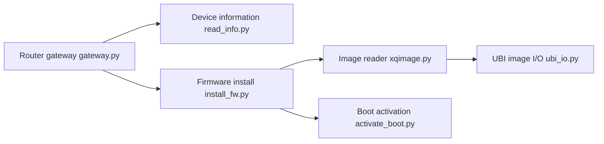

# openwrt-xiaomi/xmir-patcher

> Outil Python qui modifie le firmware de routeurs Xiaomi, pour qui veut reprendre la main sur son routeur.

## Le problème
Les routeurs Xiaomi sont fermés ; le README ne détaille pas le besoin précis. La finalité exacte est non documentée.

## Ce que ça fait vraiment
Le README tient en quelques lignes : « Firmware patcher for Xiaomi routers ». D'après le code, le dépôt contient des modules d'accès au routeur (passerelle, lecture d'infos, telnet), d'installation de firmware, d'activation du boot, de déblocage de fonctions, d'installation SSH et de langues, de sauvegarde et de redémarrage, plus des analyseurs d'images UBI/UBIFS et d'arbre de périphérique. Câblage entre ces branches non vérifié.

## Comment c'est branché


## Essayer
```bash
# Windows
run.bat
# Linux / macOS (Python 3.8+ et openssl requis)
run.sh
```

## Coût et pièges
Gratuit. Modifier le firmware d'un routeur peut le rendre inutilisable et annuler la garantie : une sauvegarde existe dans le code, mais rien n'est documenté. 80 issues ouvertes. Licence absente : droits de réutilisation non définis.

## Ce que ce n'est pas
Pas un firmware, ni OpenWrt : seulement un outil de modification. Aucune documentation d'usage, modèles compatibles non listés dans le README. À réserver à du matériel qui vous appartient.

## Alternatives
Aucune citée dans le README.

## Pour toi
Ignorer : ce travail de bricolage matériel est hors du périmètre data/IA/MLOps, et le dépôt n'a ni licence ni documentation suffisante.

