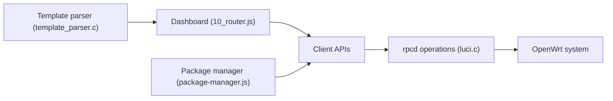

# openwrt/luci

> Interface web de configuration d'OpenWrt, pour administrer un routeur depuis le navigateur.

## Le problème
Configurer un routeur OpenWrt en ligne de commande est fastidieux.

## Ce que ce n'est pas
Pas utilisable seul : il suppose un routeur sous OpenWrt.

## Ce que ça fait vraiment
Vues client en JavaScript (tableau de bord, réseau, pare-feu, stockage, gestionnaire de paquets, fichiers) qui communiquent par RPC ; opérations côté serveur via ucode et rpcd. Fonctions en C (rpcd, DNS inverse, gabarits, TLS). Traductions via Weblate.

## Comment c'est branché


## Essayer
```bash
./scripts/feeds update luci
./scripts/feeds install -a -p luci
```

## Coût et pièges
Gratuit ; intégré au système de build OpenWrt (feed `src-git luci`). Activé par défaut.

## Alternatives
Aucune nommée dans le README.

## Pour toi
À ignorer : réseau domestique, pas data/IA/MLOps.

