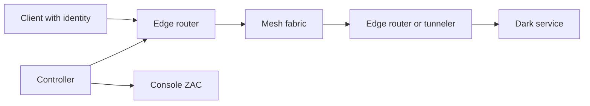

# openziti/ziti

> Plateforme zero-trust : contrôleur, routeurs et SDK rendent les services invisibles sans identité.

## Le problème
Les VPN et ports ouverts donnent trop d'accès une fois « dedans » ; il faut autoriser service par service.

## Ce que ça fait vraiment
Chaque utilisateur, appareil ou charge de travail reçoit une identité cryptographique ; les connexions passent par une surcouche maillée, chiffrées de bout en bout (mTLS, libsodium), et autorisées par politique, révocables en temps réel. Trois modèles : accès réseau (routeur), accès hôte (tunneler), accès applicatif (SDK embarqué). API REST et console web incluses.

Note : le README n'a été lu que jusqu'à « Quick Start with the CLI » ; l'architecture d'après le code n'a pas été lue.

## Comment c'est branché


## Essayer
```bash
wget https://get.openziti.io/dock/all-in-one/compose.yml
docker compose up
```

## Coût et pièges
Gratuit et auto-hébergeable. Le README renvoie à la documentation pour la production. Créé et sponsorisé par NetFoundry. 308 issues ouvertes.

## Ce que ce n'est pas
Pas un VPN clé en main : il faut définir identités, services et politiques. Le mode le plus fort exige de modifier le code des applications.

## Alternatives
- zrok : partage simplifié construit sur OpenZiti.

## Pour toi
À surveiller : pertinent pour protéger des serveurs de modèles ou des MCP privés sans port ouvert, mais mise en place non triviale.

