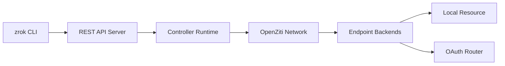

# openziti/zrok

> Partage de services web, fichiers et ports TCP/UDP via un réseau zero-trust, sans toucher au pare-feu.

## Le problème
Exposer un service local ou un dossier à quelqu'un d'autre sans ouvrir de port ni monter un VPN.

## Ce que ça fait vraiment
Le CLI `zrok` crée des partages publics ou privés. Un contrôleur (API REST) enregistre le partage, un agent se connecte via OpenZiti, et des backends (proxy public, dossier « drive », tunnels TCP/UDP) servent le trafic. OAuth et métriques d'usage (InfluxDB) sont présents. Un SDK Go permet d'embarquer le partage.

## Comment c'est branché


## Essayer
```bash
zrok invite
zrok enable
zrok share public localhost:8080
zrok share public --backend-mode drive ~/Documents
zrok share private localhost:3000
```

## Coût et pièges
Le service zrok.io est gratuit ; un compte est requis. Auto-hébergement possible (binaire unique). Le README parle d'« enterprise reliability » sans preuve.

## Ce que ce n'est pas
Pas un simple ngrok : le partage privé suppose que l'autre personne utilise aussi zrok.

## Alternatives
- OpenZiti : la plateforme sur laquelle zrok est construit.

## Pour toi
À surveiller : pratique pour exposer un notebook ou une démo de modèle sans réseau, en gardant à l'esprit la dépendance à zrok.io si tu n'auto-héberges pas.

