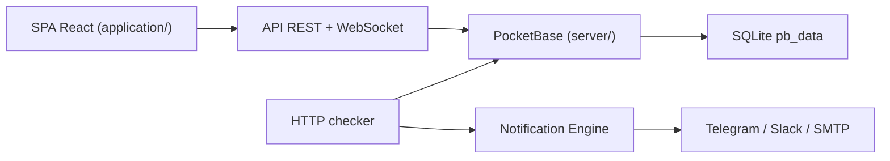

# operacle/checkcle

> Plateforme auto-hébergée de supervision d'uptime, de serveurs et de certificats, pour admins et DevOps.

## Le problème
Savoir quand un service, un domaine ou un certificat tombe, sans souscrire à un SaaS de monitoring.

## Ce que ça fait vraiment
Surveille HTTP, DNS, ping et TCP, expiration SSL/domaine, métriques serveur via un agent (Linux, Windows en bêta). Historique d'incidents, pages de statut publiques, maintenance planifiée, alertes email/Telegram/Discord/Slack/Matrix. Front React/Vite, backend PocketBase (Go + SQLite), temps réel par WebSocket.

## Comment c'est branché


## Essayer
```bash
docker run -d \
  --name checkcle \
  --restart unless-stopped \
  -p 8090:8090 \
  -v /opt/pb_data:/mnt/pb_data \
  --ulimit nofile=4096:8192 \
  operacle/checkcle:latest
```

## Coût et pièges
Gratuit. Le compte admin par défaut (admin@example.com / Admin123456) est écrit dans le README : à changer avant toute exposition. 92 issues ouvertes.

## Ce que ce n'est pas
Ce n'est pas de l'observabilité applicative (pas de traces ni de logs) : c'est de la supervision de disponibilité.

## Alternatives
Non documenté dans le README.

## Pour toi
Ignorer : supervision d'infra générique, sans lien avec le suivi de modèles ou de pipelines ; à considérer seulement pour un homelab.
