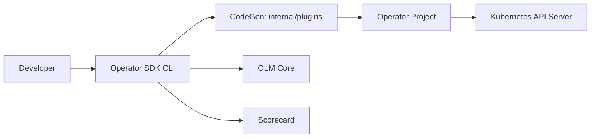

# operator-framework/operator-sdk

> SDK et CLI pour scaffolder, tester et packager des opérateurs Kubernetes (Go, Helm).

## Le problème
Écrire un opérateur Kubernetes, c'est des API bas niveau, beaucoup de code répétitif et peu de modularité.

## Ce que ça fait vraiment
Il s'appuie sur controller-runtime pour offrir des abstractions de haut niveau.
Il génère le squelette, les CRD, les manifests kustomize et les bundles OLM.
Scorecard pour valider un opérateur ; tests e2e et d'intégration.
Binaires `operator-sdk` et `helm-operator`.

## Comment c'est branché

## Essayer
Aucune commande documentée dans le README (renvoi vers le site).

## Coût et pièges
Il faut un cluster Kubernetes et Go. Les images `gcr.io/kubebuilder/kube-rbac-proxy` disparaissent : migration obligatoire.

## Ce que ce n'est pas
Pas un opérateur prêt à l'emploi : c'est un outil pour en écrire.

## Alternatives
Aucune alternative nommée dans le README (kubebuilder est cité comme projet lié, pas comme alternative).

## Pour toi
À ignorer, sauf si tu dois écrire un opérateur maison pour tes services ML : c'est de l'outillage plateforme Kubernetes spécialisé.
