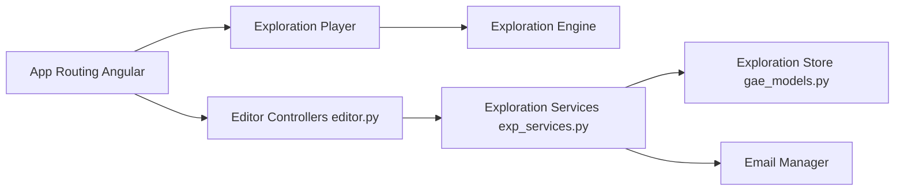

# oppia/oppia

> Plateforme d'apprentissage en ligne pour créer des activités interactives simulant un tuteur, surtout en mathématiques de base.

## Le problème
Les élèves qui n'ont pas accès à des ressources éducatives ont besoin de leçons interactives gratuites avec retour immédiat.

## Ce que ça fait vraiment
Application web Python, Angular et Google App Engine : les auteurs créent des « explorations » (dialogue avec retours), les apprenants les suivent, des contributeurs relisent et traduisent. Le code montre un moteur d'exploration, un lecteur de questions, des tests de révision, e-mail et stockage Redis. Le README décrit aussi des leçons de maths gratuites.

## Comment c'est branché

## Essayer
Aucune commande documentée dans le README : renvoi vers la page « Installing Oppia ».

## Coût et pièges
Dépend de l'écosystème Google App Engine et de services annexes (Redis, e-mail). Plus de 1 800 issues ouvertes.

## Ce que ce n'est pas
Pas un outil d'IA : le « tuteur » est un scénario écrit à la main.

## Alternatives
Aucune alternative nommée dans le README.

## Pour toi
À ignorer : plateforme éducative sans lien avec un flux data/IA/MLOps ; intéressante seulement comme grosse base de code open source à étudier.

