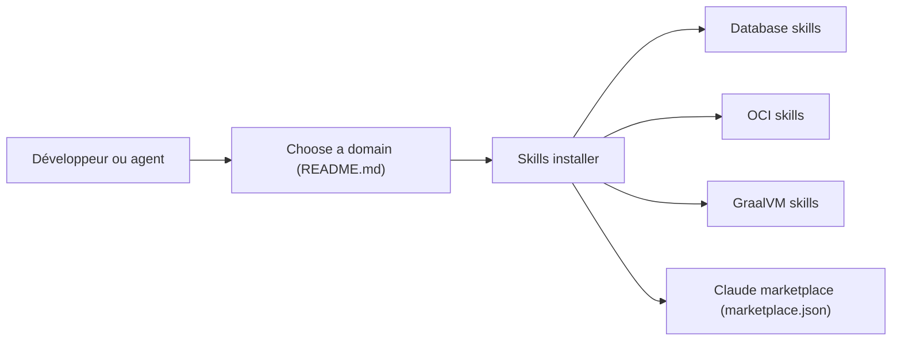

# oracle/skills

> Skills installables pour guider développeurs et agents sur Oracle Database, OCI, GraalVM et APEX.

## Le problème
Les agents donnent des conseils approximatifs sur les produits Oracle et leurs versions (19c contre 26ai).

## Ce que ça fait vraiment
Dépôt de domaines : db (ORDS, SQLcl, VecDB, PL/SQL), oci (Functions, OKE, IoT, IA d'entreprise), graal (Native Image), plus fusion et apex encore vides. Chaque domaine a un SKILL.md d'entrée. S'installe avec npx skills ou comme marketplace de plugins Claude Code. Les skills versionnés doivent avoir une section 19c contre 26ai.

## Comment c'est branché


## Essayer
```bash
npx skills add oracle/skills/db
/plugin marketplace add oracle/skills
/plugin install db@oracle-skills
```

## Coût et pièges
Gratuit ; les produits Oracle ciblés sont souvent payants. Fusion et APEX sont des squelettes. Licence UPL-1.0, permissive.

## Ce que ce n'est pas
Pas un outil exécutable ni un connecteur de base : du contenu de guidage. Qualité des sources non mesurée dans le README.

## Alternatives
Aucune alternative nommée dans le README.

## Pour toi
À ignorer sauf si tu opères sur Oracle (notamment VecDB ou OCI) : sinon, aucun apport pour ton quotidien.

