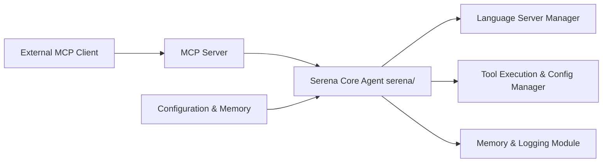

# oraios/serena

> Serveur MCP donnant aux agents de code des outils sémantiques d'IDE (symboles, références, refactorings).

## Le problème
Les agents de code manipulent le texte par lignes et regex : renommer ou déplacer un symbole à travers des fichiers devient coûteux et fragile.

## Ce que ça fait vraiment
Expose via MCP des outils au niveau symbole : trouver un symbole, ses références, remplacer un corps, insérer avant/après, renommer.
Deux backends : serveurs LSP (40+ langages) ou plugin JetBrains payant (move, inline, débogage interactif).
Inclut un système de mémoire de projet et une configuration YAML multi-niveaux (global, projet, contexte, modes).
Installation par `uv`, lancé par le client (Claude Code, Codex, Cursor…) ou en mode HTTP.

## Comment c'est branché


## Essayer
```bash
uv tool install -p 3.13 serena-agent
serena init
```

## Coût et pièges
Gratuit avec les LSP ; certains langages demandent des dépendances supplémentaires. Le plugin JetBrains est payant. Ne pas installer via un marketplace MCP (commandes obsolètes selon le README).

## Ce que ce n'est pas
Pas un agent autonome : il faut un LLM et un client MCP. Les fonctions refactoring avancées (move, inline) n'existent qu'avec le plugin payant.

## Alternatives
Aucune alternative nommée dans le README.

## Pour toi
Adopter : si tu travailles avec Claude Code ou Codex sur de gros dépôts Python, c'est le gain le plus direct en fiabilité des refactorings — vérifier seulement la licence avant usage en entreprise.
