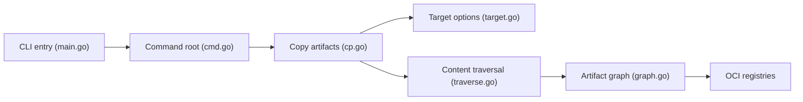

# oras-project/oras

> CLI pour pousser, tirer et copier des artefacts OCI vers des registres ; fiche minimale, README quasi vide.

## Le problème
Non documenté dans le README, qui renvoie à oras.land/cli.

## Ce que ça fait vraiment
D'après l'architecture tirée du code : commandes pull/push, copie d'artefacts entre registres et layouts OCI (`cp`, avec options de copie de graphe et étiquettes supplémentaires), découverte, manifestes, blobs, dépôts, sauvegarde/restauration et authentification, avec sorties formatées et progression.

## Comment c'est branché

## Essayer
Aucune commande documentée dans le README ; voir https://oras.land/cli.

## Coût et pièges
Non documenté dans le README.

## Ce que ce n'est pas
Pas une documentation : le README ne contient qu'un lien et un guide de développement.

## Alternatives
Aucune alternative nommée dans le README.

## Pour toi
À surveiller : utile pour stocker modèles et artefacts dans un registre OCI, mais le README ne permet pas de juger plus.

