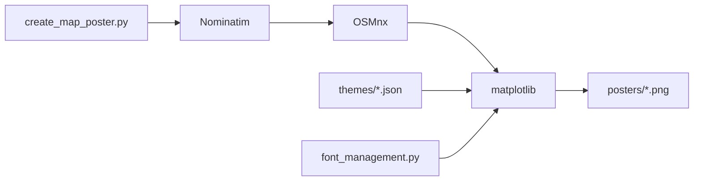

# originalankur/maptoposter

> Script Python qui génère des affiches de cartes minimalistes de n'importe quelle ville, pour créatifs.

## Le problème
Fabriquer une affiche stylisée d'un plan de ville demande d'ordinaire du SIG ou du design manuel.

## Ce que ça fait vraiment
Un script `create_map_poster.py` géocode la ville via Nominatim, télécharge routes, eau et parcs via OSMnx, puis compose une image PNG avec matplotlib. 17 thèmes JSON, tailles réglables, polices Google téléchargées pour les écritures non latines. Sortie dans `posters/`.

## Comment c'est branché


## Essayer
```bash
uv run ./create_map_poster.py --city "Paris" --country "France"
python create_map_poster.py -c "New York" -C "USA" -t noir -d 12000
python create_map_poster.py --list-themes
```

## Coût et pièges
Gratuit ; nécessite réseau (Nominatim, OSM, Google Fonts). Au-delà de 20 km de rayon : téléchargements lents et mémoire élevée. Limites de débit Nominatim.

## Ce que ce n'est pas
Pas une bibliothèque ni un service : un script unique validé surtout à l'œil.

## Alternatives
Aucune alternative citée dans le README.

## Pour toi
À surveiller : amusant pour visualiser des données géographiques, mais le mainteneur est unique (déduit du nom du propriétaire) et l'usage reste décoratif.

