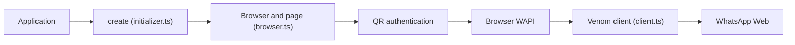

# orkestral/venom

> Bibliothèque Node.js pilotant WhatsApp Web via Puppeteer, pour créer des bots de messagerie.

## Le problème
WhatsApp n'offre pas d'API simple pour automatiser l'envoi et la lecture de messages depuis un script.

## Ce que ça fait vraiment
Lance Chromium via Puppeteer, affiche un QR code à scanner, injecte une couche WAPI dans la page et expose un client : envoi de texte, médias, sondages, listes, groupes, profil, chats, événements (messages, accusés, état de connexion, appels). Les sessions sont sauvegardées. La v6 est une réécriture ; le README annonce 6 fichiers sources. Nécessite Node 18+.

## Comment c'est branché


## Essayer
```bash
npm install venom-bot
npm install github:orkestral/venom
npm run build
```

## Coût et pièges
Gratuit, mais dépend d'un compte WhatsApp et de modules internes de WhatsApp Web qui changent : il existe une option de version Web figée. Appeler `client.close()` pour sauvegarder la session.

## Ce que ce n'est pas
Pas une API officielle de WhatsApp : l'automatisation passe par l'interface Web, avec les risques de blocage de compte associés (états `PROXYBLOCK`, `TOS_BLOCK` listés).

## Alternatives
- wppconnect-team/wa-version (cité dans le README) : pour choisir une version de WhatsApp Web.

## Pour toi
À surveiller : pratique pour un bot de notification vers un téléphone, mais fragile et hors conditions d'usage ; préfère une API officielle pour du sérieux.

