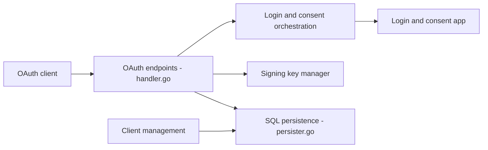

# ory/hydra

> Serveur OAuth 2.0 et fournisseur OpenID Connect certifié, qui délègue la connexion à ton application.

## Le problème
Implémenter OAuth2 et OIDC correctement est difficile (plus de 400 pages de spécifications), et on veut garder le contrôle de l'interface de connexion.

## Ce que ça fait vraiment
Serveur autonome sans gestion d'utilisateurs : il orchestre les flux de connexion et consentement avec une application externe, émet et valide les jetons, gère clients et JWKS, autorisation d'appareil et grants JWT. Persistance SQL (PostgreSQL, MySQL, CockroachDB), gestionnaire de clés avec option matérielle. Existe en auto-hébergé ou sur Ory Network.

## Comment c'est branché


## Essayer
```bash
bash <(curl https://raw.githubusercontent.com/ory/meta/master/install.sh) -b . ory
ory auth
ory create project --create-workspace "Ory Open Source" --name "GitHub Quickstart" --use-project
ory create oauth2-client --name "Client Credentials Demo" --grant-type client_credentials
```

## Coût et pièges
Le quickstart passe par un compte Ory Network. En production critique, le README recommande l'Ory Enterprise License (CVE sous SLA, fonctions absentes de la version libre). Télémétrie anonyme, désactivable.

## Ce que ce n'est pas
Pas un gestionnaire d'identités : pas d'utilisateurs ni de mots de passe, c'est le rôle de Kratos ou de ton propre système.

## Alternatives
- Ory Kratos : gestion des identités et de l'inscription.
- Ory Oathkeeper : proxy d'accès.
- Ory Keto : politiques d'autorisation.

## Pour toi
À surveiller : pertinent pour sécuriser des API de plateforme ML, mais la voie d'essai passe par un SaaS et la version libre a des limites.

