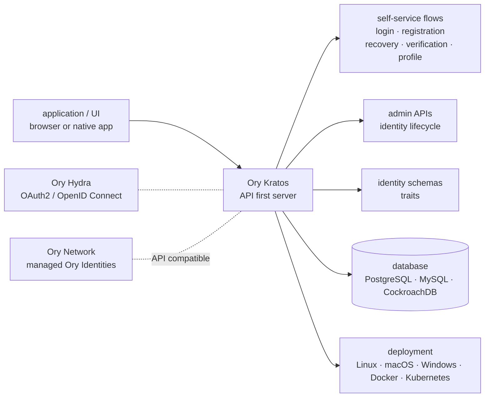

# ory/kratos

> **A standalone identity server that moves login, registration and recovery out of your app code.**

## The problem

Every application ends up rewriting the same journeys: sign-up, sign-in, address verification,
forgotten password, second factor, profile editing. That code is long, sensitive, duplicated
across services, and it is the code whose flaws cost the most.

## What it actually does

Kratos is an HTTP server that hosts those journeys and exposes them over APIs, so services consume
them instead of reimplementing them. The README lists the scope: self-service login and
registration, account verification and recovery, multi-factor authentication, profile and account
management, identity schemas and traits, and admin APIs for lifecycle management.

The stance is "API first": Kratos does not ship the screens. It exposes flows designed for two
contexts — browser-based and native app — that any UI framework can dress. Identities are
described by a schema you define yourself, hence the arbitrary traits.

What it does *not* do itself is equally clear: OAuth2 and OpenID Connect are Ory Hydra's job,
access control belongs to the rest of the Ory stack. The README explicitly recommends
**Hydra + Kratos** together when migrating off Auth0 or Okta: Hydra replaces the authorization
server and token issuing, Kratos supplies identities, credentials and the user-facing flows, and
applications keep speaking the same protocols.

## How it is wired



No code-derived diagram exists for this repository: this one is reconstructed from the README
alone, so it carries no real file names. Dotted links mark neighbouring pieces (Hydra, the managed
offering) that do not live in this repo.

## Trying it

The README documents no command for starting the self-hosted server — it points to the online
install guide. The only sequence it gives goes through the Ory CLI and the managed offering:

```bash
# Install the Ory CLI if you do not have it yet:
bash <(curl https://raw.githubusercontent.com/ory/meta/master/install.sh) -b . ory
sudo mv ./ory /usr/local/bin/

# Sign in or sign up
ory auth

# Create a new project
ory create project --create-workspace "Ory Open Source" --name "GitHub Quickstart"  --use-project
ory open ax login
```

## Cost and gotchas

- **The quickstart is not self-hosted.** It creates a project on the Ory Network: an account is
  required (`ory auth`), and the network is priced by usage. A free developer account is offered,
  but it is still a third-party service.
- **No API key, no GPU**, no compute requirement: the cost is operational, not hardware.
- **A database is mandatory** when self-hosting — PostgreSQL, MySQL or CockroachDB, which you run
  and back up yourself, with everything that implies for identity data.
- **Features reserved for the commercial licence.** The README is explicit: SCIM, SAML,
  organization login ("SSO"), CAPTCHAs and more are **not** in the open source version. They come
  with the Ory Enterprise Licence, along with access to a private Docker registry.
- **Guaranteed security fixes are commercial.** Again per the README, regular security releases
  and CVE patches with service level agreements are tied to the OEL. The open source distribution
  is presented for experimenting, prototyping or running unimportant workloads without SLAs.
- **You write the UI.** Prebuilt login and account management pages are listed as an Ory Network
  benefit, not something the open source server provides.

## What it is not

- **It is not an OAuth2 / OpenID Connect server.** Kratos does not issue tokens; Hydra does.
  Anyone arriving expecting to replace Auth0 with this repo alone has picked the wrong brick.
- **It is not a turnkey product with screens.** No UI on the open source side; you consume APIs
  and build the pages.
- **The open source build is not equivalent to the paid one**: SCIM, SAML, organization SSO,
  CAPTCHAs and CVE fixes under SLA sit behind the enterprise licence. For a business-critical
  system the README itself steers you toward a commercial agreement.

## Alternatives

| | When to prefer it |
|---|---|
| **ory/hydra** | Named in the README, and complementary rather than competing: reach for it when the need is issuing OAuth2 / OIDC tokens. Both together for an Auth0 or Okta migration; Kratos alone if you only need user accounts. |
| **casdoor/casdoor** | A catalogue neighbour, also Go and also identity: prefer it when you want an admin console and login pages shipped with the server, rather than a pure API core you have to dress. |

The other neighbours (`vxcontrol/pentagi`, `chaitin/SafeLine`) are offensive security and web
application firewall tooling: nothing comparable to identity management.

## For you

Little direct bearing on data or model work: this is application infrastructure. Watch rather than
adopt, and only with a concrete case — the day an internal platform, a notebook portal or an
inference API needs real user accounts, this is the proven brick to reach for instead of writing
your own login flows. Check first that what you need (organization SSO, SAML) is not on the paid
side.
