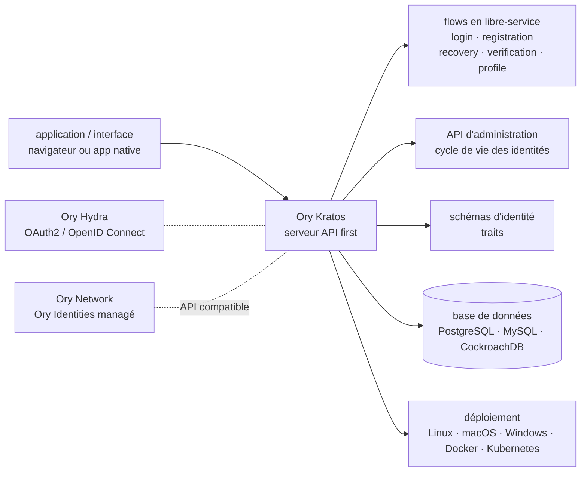

# ory/kratos

> **Un serveur d'identité à part, qui sort connexion, inscription et récupération du code applicatif.**

## Le problème

Chaque application finit par réécrire les mêmes parcours : inscription, connexion, vérification
d'adresse, mot de passe oublié, second facteur, édition de profil. Ce code est long, sensible,
dupliqué d'un service à l'autre, et c'est celui dont les failles coûtent le plus cher.

## Ce que ça fait vraiment

Kratos est un serveur HTTP qui héberge ces parcours et les expose en API, pour que les services
les consomment au lieu de les réimplémenter. Le README énumère son périmètre : connexion et
inscription en libre-service, vérification et récupération de compte, authentification
multifacteur, gestion de profil et de compte, schémas d'identité et *traits*, API d'administration
pour le cycle de vie des identités.

Le parti pris est « API first » : Kratos ne fournit pas les écrans. Il expose des *flows* prévus
pour deux contextes — navigateur et application native — que n'importe quel cadriciel d'interface
vient habiller. Les identités sont décrites par un schéma que l'on définit soi-même, d'où les
traits arbitraires.

Ce qu'il ne fait pas lui-même est tout aussi net : OAuth2 et OpenID Connect sont le travail d'Ory
Hydra, le contrôle d'accès celui du reste de la pile Ory. Le README recommande explicitement
**Hydra + Kratos** ensemble pour migrer depuis Auth0 ou Okta : Hydra remplace le serveur
d'autorisation et l'émission de jetons, Kratos apporte les identités, les identifiants et les
parcours utilisateur, et les applications continuent de parler les mêmes protocoles.

## Comment c'est branché



Aucun diagramme tiré du code n'existe pour ce dépôt : ce schéma est reconstruit depuis le seul
README, donc sans noms de fichiers réels. Les liens pointillés marquent les briques voisines
(Hydra, l'offre managée) qui ne sont pas dans ce dépôt.

## Essayer

Le README ne documente aucune commande de lancement du serveur auto-hébergé — il renvoie au guide
d'installation en ligne. La seule séquence donnée passe par la CLI Ory et l'offre managée :

```bash
# Install the Ory CLI if you do not have it yet:
bash <(curl https://raw.githubusercontent.com/ory/meta/master/install.sh) -b . ory
sudo mv ./ory /usr/local/bin/

# Sign in or sign up
ory auth

# Create a new project
ory create project --create-workspace "Ory Open Source" --name "GitHub Quickstart"  --use-project
ory open ax login
```

## Coût et pièges

- **Le démarrage rapide n'est pas auto-hébergé.** Il crée un projet sur l'Ory Network : il faut un
  compte (`ory auth`), et la tarification du réseau est à l'usage. Le README propose un compte
  développeur gratuit, mais c'est bien un service tiers.
- **Pas de clé d'API ni de GPU**, aucun besoin de calcul : le coût est opérationnel, pas matériel.
- **Une base de données est obligatoire** en auto-hébergement — PostgreSQL, MySQL ou CockroachDB,
  à exploiter et à sauvegarder soi-même, avec ce que cela suppose pour des données d'identité.
- **Fonctions réservées à la licence commerciale.** Le README est explicite : SCIM, SAML, le login
  d'organisation (« SSO »), les CAPTCHAs et d'autres fonctions ne sont **pas** dans la version
  open source. Elles relèvent de l'Ory Enterprise License, avec accès à un registre Docker privé.
- **Les correctifs de sécurité garantis sont commerciaux.** Toujours d'après le README, les
  publications régulières de sécurité et les correctifs de CVE avec engagement de service sont
  liées à l'OEL. La distribution open source est présentée pour « expérimenter, prototyper ou
  faire tourner des charges peu importantes sans SLA ».
- **Il faut écrire l'interface.** Les pages de connexion et de gestion de compte prêtes à l'emploi
  sont listées comme un apport de l'Ory Network, pas du serveur open source.

## Ce que ce n'est pas

- **Ce n'est pas un serveur OAuth2 / OpenID Connect.** Kratos ne délivre pas de jetons : c'est
  Hydra. Qui arrive en croyant remplacer Auth0 avec ce seul dépôt se trompe de brique.
- **Ce n'est pas une solution clés en main avec écrans.** Pas d'interface fournie côté open
  source ; on consomme des API et on construit les pages.
- **Ce n'est pas une version open source équivalente à l'offre payante** : SCIM, SAML, SSO
  d'organisation, CAPTCHAs et les CVE sous SLA sont derrière la licence entreprise. Pour un
  système critique, le README oriente lui-même vers un contrat commercial.

## Alternatives

| | Quand le préférer |
|---|---|
| **ory/hydra** | Nommé dans le README, et complémentaire plutôt que concurrent : à prendre quand le besoin est d'émettre des jetons OAuth2 / OIDC. Les deux ensemble pour une migration depuis Auth0 ou Okta ; Kratos seul si l'on veut juste des comptes utilisateurs. |
| **casdoor/casdoor** | Voisin du catalogue, également en Go sur l'identité : à préférer quand on veut une interface d'administration et des pages de connexion livrées avec le serveur, plutôt qu'un socle purement API à habiller. |

Les autres voisins (`vxcontrol/pentagi`, `chaitin/SafeLine`) relèvent de la sécurité offensive et
du pare-feu applicatif : rien de comparable à la gestion d'identités.

## Pour toi

Peu de rapport direct avec le travail data ou modèle : c'est de l'infrastructure applicative. À
surveiller plutôt qu'à adopter, avec un cas d'usage précis — le jour où une plateforme interne,
un portail de *notebooks* ou une API d'inférence doit gérer de vrais comptes utilisateurs, c'est
la brique éprouvée à sortir plutôt que d'écrire ses propres parcours de connexion. Vérifier
d'abord que ce dont on a besoin (SSO d'organisation, SAML) n'est pas du côté payant.
