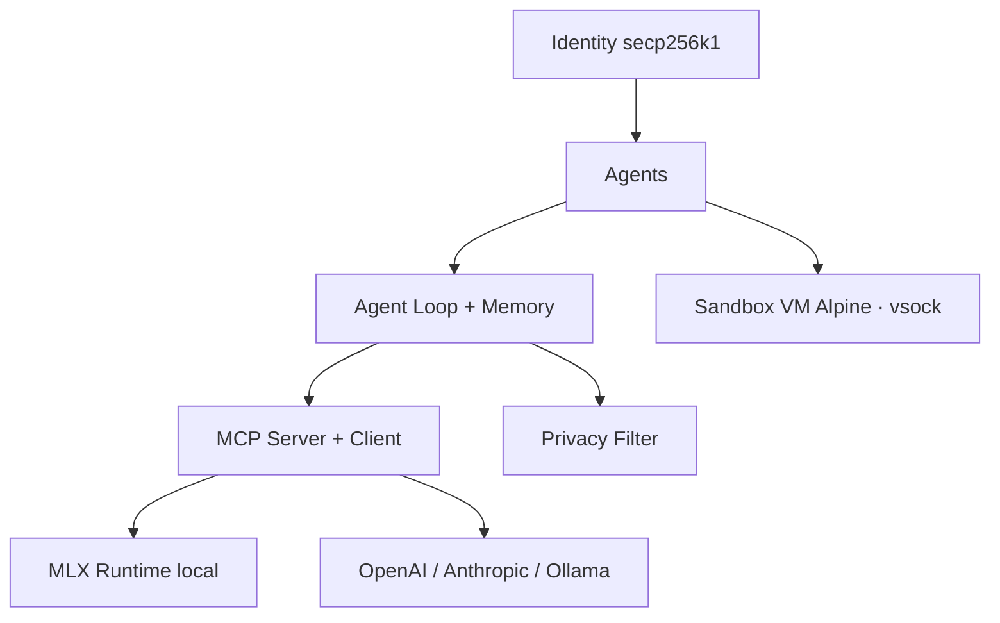

# osaurus-ai/osaurus

> Harnais d'agents natif macOS, en Swift, qui garde mémoire, outils et identité sur la machine.

## Le problème
Les assistants du marché hébergent la couche qui compte — contexte, mémoire, outils, identité —
sur leurs serveurs. On change de modèle facilement, jamais de fournisseur de mémoire.

## Ce que ça fait vraiment
Chaque agent a ses prompts, sa mémoire à trois couches (identité, faits épinglés, épisodes) et
sa boucle d'exécution avec liste de tâches markdown. Le bac à sable est une VM Linux Alpine via
Apple Containerization, reliée par vsock. Un filtre de confidentialité local détecte et masque
les données personnelles avant tout envoi cloud, en *fail-closed*. Serveur MCP complet, et client
MCP vers ~25 fournisseurs distants. Endpoints compatibles OpenAI, Anthropic et Ollama.

## Comment c'est branché


## Essayer
```bash
brew install --cask osaurus
osaurus ui
osaurus serve --port 1337
osaurus tools install osaurus.calendar
osaurus mcp
```

## Coût et pièges
macOS 15.5+ et Apple Silicon obligatoires ; la VM Linux demande macOS 26+, sinon repli sur un
sandbox Seatbelt plus limité. Le filtre de confidentialité charge un modèle de ~2,8 Go. Le
stockage local est en clair par défaut (chiffrement SQLCipher optionnel). **Télémétrie** :
analytics Aptabase opt-in, mais le rapport de crash Sentry est opt-out, actif par défaut.

## Ce que ce n'est pas
Ce n'est pas multiplateforme : Swift, Apple Silicon, rien d'autre. L'Orchestrator intégré ne fait
volontairement aucun travail concret — ni dossier de travail, ni sandbox, ni navigateur. Osaurus
Router, le chemin hébergé, est payant à l'usage.

## Alternatives
- **Ollama / LM Studio** : cités comme fournisseurs ; suffisent si tu ne veux que de l'inférence locale.

## Pour toi
Intéressant si tu es sur Mac et que la confidentialité prime ; sinon c'est un écosystème fermé.
