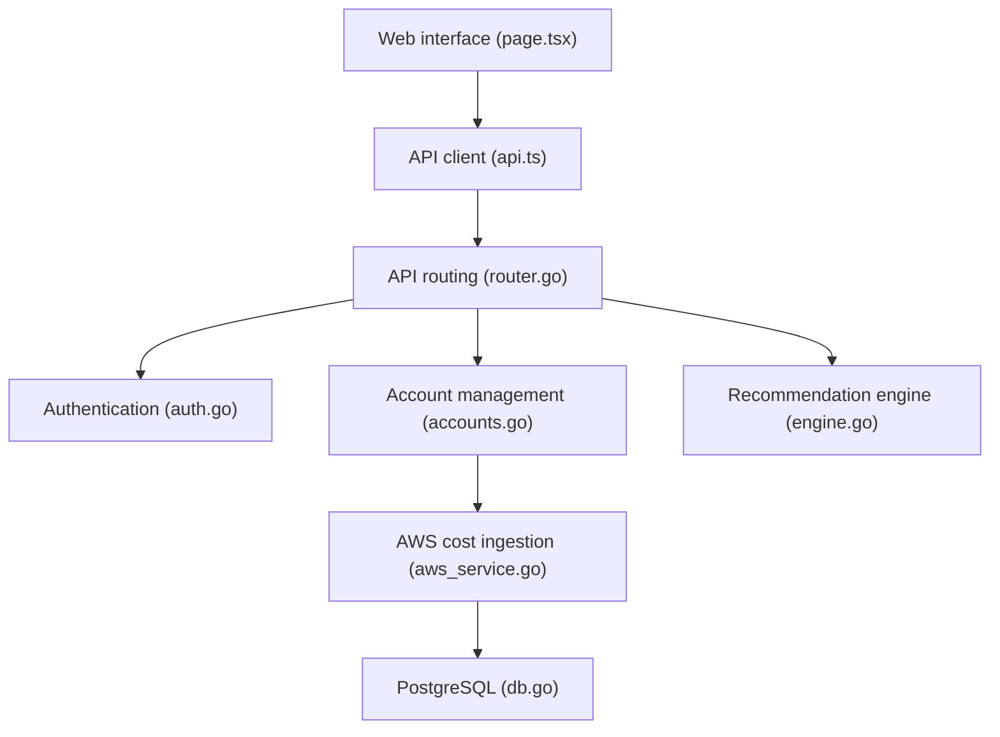

# oseghalep/cloud-cost-optimization-hub

> Application web de suivi des coûts AWS, GCP et Azure, en version 0.1 avec données fictives.

## Le problème
Les factures cloud arrivent par fournisseur, séparées, et les dérives se découvrent tard. Il manque une vue unique des coûts et des pistes d'économie.

## Ce que ça fait vraiment
Un utilisateur s'inscrit, se connecte et voit un tableau de bord alimenté par des **données de démonstration**. Le code contient des services d'ingestion AWS, GCP et Azure et un moteur de recommandations, mais le README ne décrit que « ready for real integration » : l'intégration réelle n'est pas documentée comme faite. Backend Go (Gin), PostgreSQL + TimescaleDB, Redis, frontend Next.js 14.

## Comment c'est branché


## Essayer
```bash
git clone https://github.com/oseghalep/cloud-cost-optimization-hub.git
cd cloud-cost-optimization-hub
cp .env.example .env
make up
# puis http://localhost:3000, créer un compte sur /register
```

## Coût et pièges
Gratuit en local via Docker Compose (démarrage ~30 s). Une intégration réelle demanderait des identifiants cloud, non documentés ici.

## Ce que ce n'est pas
Pas un outil FinOps opérationnel : les coûts affichés sont fictifs dans la v0.1. Le chart Helm « prod » est mentionné mais pas détaillé.

## Alternatives
Aucune alternative nommée dans le README.

## Pour toi
Ignorer : prototype 0.1 sur données simulées, licence non identifiée et mainteneur unique ; rien à en tirer pour du suivi de coûts réel.

