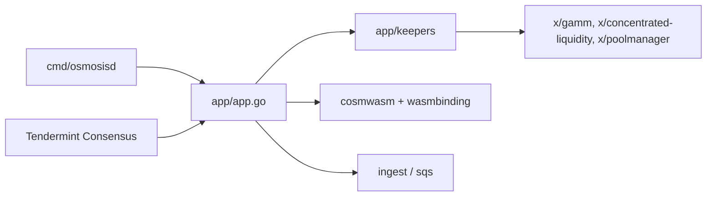

# osmosis-labs/osmosis

> Nœud de la blockchain Osmosis, bourse décentralisée du Cosmos, pour validateurs et développeurs de DeFi.

## Le problème
Échanger des actifs entre chaînes Cosmos sans intermédiaire centralisé suppose une chaîne dédiée avec pools de liquidité, frais et gouvernance intégrés.

## Ce que ça fait vraiment
Implémente une chaîne applicative Cosmos SDK en Go : modules de pools (GAMM, liquidité concentrée), verrouillage, incitations, frais, IBC, contrats CosmWasm et services d'ingestion (`ingest`, `sqs`). Le README renvoie à docs.osmosis.zone pour rejoindre le mainnet et propose LocalOsmosis, un testnet conteneurisé.

## Comment c'est branché

## Essayer
Le README ne donne aucune commande : il renvoie à la documentation officielle (rejoindre le mainnet, LocalOsmosis).

## Coût et pièges
Configuration recommandée : 4 cœurs amd64, 64 Go de RAM (swap toléré), 1 To NVMe, 100 Mbit/s ; ARM (M1) non supporté. 181 issues ouvertes.

## Ce que ce n'est pas
Ce n'est pas une bibliothèque ni une API prête à l'emploi : c'est un nœud de blockchain complet. Le README est surtout promotionnel.

## Alternatives
Le README ne cite aucune alternative.

## Pour toi
À ignorer : infrastructure de blockchain lourde, sans usage pour un profil data/IA/MLOps hors intérêt spécifique pour le DeFi.

