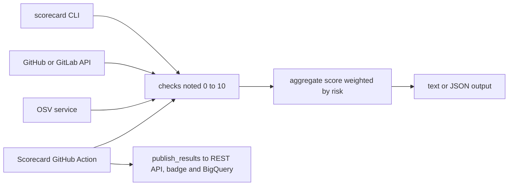

# ossf/scorecard

> **Scores an open source repo's security practices from 0 to 10, for maintainers and for dependency consumers.**

## The problem

Without it, deciding whether a dependency is "safe" is guesswork: you open the repo, check
whether a security policy exists, whether code review happens, whether releases are signed —
by hand, repo by repo, with no stable criteria and no comparable record over time.

## What it actually does

Scorecard runs a set of heuristics ("checks") against a repo and scores each one from 0 to 10:
Binary-Artifacts, Branch-Protection, CI-Tests, Code-Review, Contributors, Dangerous-Workflow,
Dependency-Update-Tool, Fuzzing, License, Maintained, Pinned-Dependencies, Packaging, SAST,
Security-Policy, Signed-Releases, Token-Permissions, Vulnerabilities and Webhooks (flagged
EXPERIMENTAL). It then computes an aggregate score, a risk-weighted average: 10 for "Critical",
7.5 "High", 5 "Medium", 2.5 "Low". It queries the GitHub and GitLab APIs and the OSV service;
it measures, it fixes nothing. Output is text or JSON (`--format=json`), with a remediation
link per check. The project also publishes a weekly scan of the 1 million most critical
projects in the public BigQuery dataset `openssf:scorecardcron.scorecard-v2`, plus a REST API,
a webviewer and a README badge.

## How it is wired



Three front doors onto one check engine: the local CLI (`--repo=...`), the
`ossf/scorecard-action` GitHub Action that reruns on repository change and raises alerts in
the Security tab, and the precomputed weekly cron data. Checks hit the forge API (token
required, otherwise rate limits) and OSV for vulnerabilities; the aggregate score is only a
weighting at the end. The list of repos tracked by the cron lives in
`cron/internal/data/projects.csv`.

## Trying it

```shell
docker pull ghcr.io/ossf/scorecard:latest
```

```shell
export GITHUB_AUTH_TOKEN=<your access token>
scorecard --repo=github.com/ossf-tests/scorecard-check-branch-protection-e2e
```

```shell
docker run -e GITHUB_AUTH_TOKEN=token ghcr.io/ossf/scorecard:latest --show-details --repo=https://github.com/ossf/scorecard
```

Also `brew install scorecard`, `nix-shell -p nixpkgs.scorecard`, or the release zip dropped
into `GOPATH/bin`. On GitLab: `export GITLAB_AUTH_TOKEN=glpat-xxxx` then
`scorecard --repo gitlab.com/<org>/<project>/<subproject>`.

## Cost and traps

Free, Apache-2.0, but a token is needed: GitHub rate-limits unauthenticated requests, so a
classic PAT (the `public_repo` scope is suggested) in `GITHUB_AUTH_TOKEN`, or a GitHub App
Installation for higher quotas; some Branch-Protection settings only read with a maintainer
PAT, and Webhooks needs `admin: repo_hook`. Go is required for the standalone install. The
README supports OSX and Linux; on Windows "you may experience issues". REST API scores omit
`CI-Tests`, `Contributors` and `Dependency-Update-Tool` because of API costs at scale, and are
served through a CDN, so they can be stale. REST API data is licensed CDLA Permissive 2.0,
separate from the code license.

## What it is not

It is not a security audit or a code scanner: these are heuristics, and the README itself
says there are "false positives and false negatives". It is not a standard to comply with —
the non-goals state that every step is opinionated: which checks are in, their importance,
how scores are computed. The aggregate score says nothing about individual behaviors, several
paths reach the same number, and it shifts as heuristics are added or refined; the README
points instead to structured results and probes (e.g. `archived`). And 2FA is not a check,
since GitHub and GitLab do not make that data public, even though it is recommended.

## Alternatives

No comparable neighbor in the catalogue (SigmaHQ/sigma, DataDog/dd-trace-go,
microsoft/TypeScript, prometheus/prometheus address other needs). From the README:
`ossf/scorecard-action` is the same engine as an Action, preferable on repos you own; CodeQL
or SonarCloud analyze the code itself where Scorecard only judges practices; OSV answers only
the known-vulnerability question.

## For you

To triage Python or Go dependencies before they enter an ML pipeline, this is the cheapest
filter: one `--format=json` per repo, or a BigQuery query on the public dataset to do it at
scale. Read it as a bundle of signals, never as a green light.
