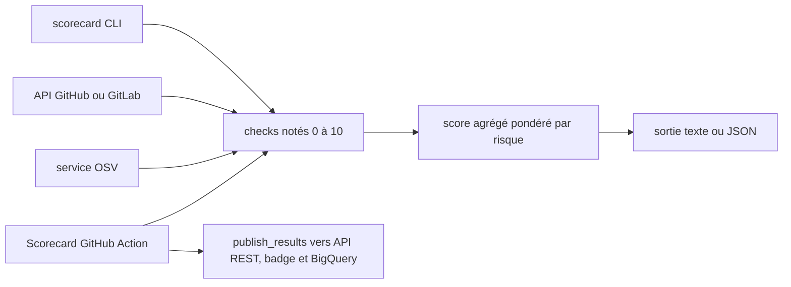

# ossf/scorecard

> **Note de 0 à 10 les pratiques de sécurité d'un dépôt open source, pour maintenir ou pour choisir une dépendance.**

## Le problème

Sans lui, juger si une dépendance est « sûre » se fait à l'intuition : on ouvre le dépôt, on
regarde s'il y a une politique de sécurité, si les revues de code existent, si les releases
sont signées — à la main, dépôt par dépôt, sans critère stable ni trace comparable dans le temps.

## Ce que ça fait vraiment

Scorecard exécute une série d'heuristiques (« checks ») sur un dépôt et donne à chacune une
note de 0 à 10 : Binary-Artifacts, Branch-Protection, CI-Tests, Code-Review, Contributors,
Dangerous-Workflow, Dependency-Update-Tool, Fuzzing, License, Maintained, Pinned-Dependencies,
Packaging, SAST, Security-Policy, Signed-Releases, Token-Permissions, Vulnerabilities, Webhooks
(marqué EXPERIMENTAL). Il calcule ensuite un score agrégé, moyenne pondérée par le risque :
10 pour « Critical », 7,5 « High », 5 « Medium », 2,5 « Low ». Il interroge les API GitHub,
GitLab et le service OSV ; il ne corrige rien, il mesure. La sortie est du texte ou du JSON
(`--format=json`), avec un lien de remédiation par check. Le projet publie aussi un scan
hebdomadaire du million de dépôts les plus critiques dans un dataset public BigQuery
`openssf:scorecardcron.scorecard-v2`, une API REST, un webviewer et un badge de README.

## Comment c'est branché



Trois portes d'entrée pour le même moteur de checks : la CLI locale (`--repo=...`), la
GitHub Action `ossf/scorecard-action` qui rejoue le scan à chaque changement et remonte les
alertes dans l'onglet Security, et les données pré-calculées du cron hebdomadaire. Les checks
tapent sur l'API de la forge (jeton obligatoire, sinon rate limit) et sur OSV pour les
vulnérabilités ; le score agrégé n'est qu'une pondération en sortie. La liste des dépôts
suivis par le cron vit dans `cron/internal/data/projects.csv`.

## Essayer

```shell
docker pull ghcr.io/ossf/scorecard:latest
```

```shell
export GITHUB_AUTH_TOKEN=<your access token>
scorecard --repo=github.com/ossf-tests/scorecard-check-branch-protection-e2e
```

```shell
docker run -e GITHUB_AUTH_TOKEN=token ghcr.io/ossf/scorecard:latest --show-details --repo=https://github.com/ossf/scorecard
```

Aussi `brew install scorecard`, `nix-shell -p nixpkgs.scorecard`, ou le zip de la page de
releases à poser dans `GOPATH/bin`. Sur GitLab : `export GITLAB_AUTH_TOKEN=glpat-xxxx` puis
`scorecard --repo gitlab.com/<org>/<project>/<subproject>`.

## Coût et pièges

Gratuit, Apache-2.0, mais il faut un jeton : GitHub impose des rate limits sur les requêtes
non authentifiées, donc un PAT classique (scope `public_repo` suggéré) dans `GITHUB_AUTH_TOKEN`,
ou une GitHub App pour un quota plus haut ; certains réglages de Branch-Protection ne sont
lisibles qu'avec un PAT de mainteneur, et Webhooks demande `admin: repo_hook`. Go est requis
pour l'installation standalone. Le README annonce OSX et Linux ; sous Windows « you may
experience issues ». Les scores de l'API REST omettent `CI-Tests`, `Contributors` et
`Dependency-Update-Tool` à cause du coût d'API à l'échelle, et sont servis par un CDN, donc
parfois périmés. Les données de l'API REST sont sous CDLA Permissive 2.0, licence distincte
du code.

## Ce que ce n'est pas

Ce n'est pas un audit de sécurité ni un scanner de code : ce sont des heuristiques, et le
README dit lui-même qu'il y a « false positives and false negatives ». Ce n'est pas une norme
à suivre : les non-goals affirment que tout est opinionné — quels checks entrent, leur poids,
le calcul. Le score agrégé ne dit rien des comportements individuels, plusieurs chemins mènent
au même chiffre, et il bouge quand les heuristiques évoluent ; le README pousse d'ailleurs les
résultats structurés (probes, p. ex. `archived`) plutôt que le X/10. Enfin le 2FA n'est pas
un check, faute de données publiques, alors que c'est recommandé.

## Alternatives

Pas d'équivalent dans les voisins du catalogue (SigmaHQ/sigma, DataDog/dd-trace-go,
microsoft/TypeScript, prometheus/prometheus ne couvrent pas le même besoin). Dans le README :
`ossf/scorecard-action` est la même chose en Action, à préférer sur ses propres dépôts ;
CodeQL ou SonarCloud analysent le code lui-même là où Scorecard ne juge que les pratiques ;
OSV répond seulement à la question des vulnérabilités connues.

## Pour toi

Pour trier des dépendances Python ou Go avant de les faire entrer dans une chaîne ML, c'est
le filtre le moins coûteux : un `--format=json` par dépôt, ou une requête BigQuery sur le
dataset public pour industrialiser le tri. À lire comme un faisceau d'indices, jamais comme
un feu vert.
